<!DOCTYPE html>
<html>

<body lang="en-US" text="#000000" link="#000080" vlink="#551a8b" dir="ltr">

 
 

 
 

 
 

 
 

 
 

 
 

 
 

 
 

 
 

 
 

 
 

 
 

 
 

УМНОЕ
МУЛЬТИМЕДИЙНОЕ УСТРОЙСТВО

ПОД
УПРАВЛЕНИЕМ СИСТЕМЫ С

ГОЛОСОВЫМ
АССИСТЕНТОМ

 

 

 

 

 

 

 

 

 
 

	

		<b>СОДЕРЖАНИЕ</b>

	

	
ВВЕДЕНИЕ	3

	
ГЛАВА
	I – «ПОИСКОВО-ИССЛЕДОВАТЕЛЬСКИЙ ЭТАП»	5

	

	1.1.
	Актуальность темы проекта; обоснование
	проблемы, решаемой в проекте	5

	

	1.2.
	Цель и задачи проекта	6

	

	1.3.
	История возникновения умных колонок	6

	

	1.4.
	Анализ аналогов программного продукта	7

	

	1.5.
	Выводы и рекомендации по первой главе	11

	
ГЛАВА
	II – «КОНСТРУКТОРСКО-ТЕХНОЛОГИЧЕСКИЙ
	ЭТАП»	12

	

	2.1.
	Описание устройства	12

	

	2.2.
	Руководство программиста	16

	

	2.3.
	Руководство пользователя	17

	

	2.4.
	Выбор материалов и компонентов	17

	

	2.5.
	Технологическая карта	18

	

	2.6.
	Выбор оборудования и программного
	обеспечения	19

	
ГЛАВА
	III – «ЭКОЛОГО-ЭКОНОМИЧЕСКОЕ ОБОСНОВАНИЕ»	21

	

	3.1.
	Экологическое обоснование	21

	

	3.2.
	Экономическое обоснование	21

	
ЗАКЛЮЧЕНИЕ	25

	
СПИСОК
	ЛИТЕРАТУРЫ	25

	
ПРИЛОЖЕНИЕ
	А	27

	
ПРИЛОЖЕНИЕ
	Б	29

	
ПРИЛОЖЕНИЕ
	В	31

<h1 lang="ru-RU" class="western" style="line-height: 150%"> 
 

</h1>
<ol>
	<li><h1 class="western" style="margin-top: 0mm; line-height: 150%; page-break-before: always">
	ВВЕДЕНИЕ</h1></li>
</ol>

Я
рад представить Вам мультимедийное
устройство, которое способно улучшить
качество жизни многих людей. Это не
просто плеер музыки или напоминалка, а
организатор рабочего процесса и
повседневности, центр управления умным
домом, помощник в любом деле: от готовки
до бизнес автоматизации. Главное отличие
моего проекта от существующих – работа
на устройстве локально, приватность и
следование принципам FOSS
(Free
and
Open-Source
Software).
Написанная мной система может
распространяться бесплатно, все ее
функции доступны бесплатно, ее код может
посмотреть и изменить под себя любой
желающий и убедиться, что мой продукт
не собирает никаких персональных данных.
Также пользователь может легко превратить
колонку в центр умного дома, роутер,
проектор, игровую консоль, файловый
сервер или все сразу, используя
дополнительные модули, которые достаточно
подключить к колонке и подгрузить пакет
программного обеспечения. Таким образом
модульная архитектура позволяет каждому
создать умный дом своей мечты, исходя
из своих потребностей. Благодаря
активному участию сообщества набор
функций будет дополняться. Так как
дизайн у таких устройств обычно скучный,
я решил сделать съемные корпуса, которые
крепятся на базовый корпус. Так, устройство
становится своеобразным конструктором,
свободным от рамок.

На
этапе разработки я сравнивал существующие
устройства, анализировал их характеристики,
преимущества, недостатки, статистические
данные. На основе полученных сведений
я моделировал свое устройство учитывая
проблемы и выигрышные стороны существующих
аналогов.

В
моем проекте впервые в мире используется
голосовой ассистент с полностью локальной
обработкой данных, которая позволяет
обеспечить абсолютную безопасность
чувствительной информации.

В
мире еще не было ни одного полностью
локального голосового ассистента, тем
более работающего на русском языке. Мой
продукт бесплатен и распространяется
по свободной лицензии и каждый может
использовать и дорабатывать его под
себя. Таким образом проект вносит весомый
вклад в развитие не только российской
сферы информационных технологий, но и
в российское общество, которое получает
новый инструмент обустройства быта.

Возможность
внедрения данного предложения:

<ol>
	<li>

	Для
	повседневного домашнего использования
</li>
	<li>

	Для
	корпоративного использования
</li>
	<li>

	Инструмент
	для продвинутых пользователей и
	разработчиков
</li>
	<li>

	Инструмент
	образования
</li>
</ol>

 

 

 

<ol start="2">
	<li><h1 class="western" align="justify" style="margin-top: 0mm; line-height: 150%; page-break-before: always">
	ГЛАВА
	I
	– «ПОИСКОВО-ИССЛЕДОВАТЕЛЬСКИЙ ЭТАП»</h1></li>
</ol>
<h2 class="western" align="justify" style="line-height: 150%">
1.1.
Актуальность темы проекта; обоснование
проблемы, решаемой в проекте</h2>

В
современном мире технологии плотно
интегрированы в нашу жизнь. От качества
технологий, которыми мы пользуемся
зависит и качество нашей жизни. У нас
есть различные гаджеты и по отдельности
они достаточно удобные, но бывают
ситуации, когда у нас заняты руки и нужно
получить какую-либо информацию. Для
таких случаев стал использоваться
интерфейс голосового ввода. Представим
ситуацию: вы готовите торт, но забыли,
сколько ложек сахара необходимо класть.
Вы можете запросить рецепт нужного вам
торта у умной колонки или запросить
только количество ложек сахара для
определенного торта. Мое устройство
понимает контекст, используя локальную
языковую модель и выдает конкретизированный
результат, отлично подходит для домохозяек
с детьми.

Сегодня
рынок умных колонок монополизирован
крупными корпорациями. Их продукты
разрабатываются командами разработчиков,
которые создают качественные устройства,
но их системы закрыты, и пользователь
не знает, что компания делает с его
данными. Их колонки не сами обрабатывают
голосовые запросы пользователя. Они
пересылают запросы на сервера компании,
где голос анализируется и формируется
ответ для пользователя. Обработка и
хранение данных на сервере чревато
утечкой персональных данных. Умные
колонки с локальной обработкой и выводом
данных создавали только энтузиасты и
в производство такие устройства не
поступали. Такие устройства разрабатывались
только для самих разработчиков. Мое
устройство решает проблему вероятности
утечки моих персональных данных, все
действия выполняются локально.

Умные
колонки крупных компаний предлагают
платить подписку за полноценное
использование устройства. Без этой
подписки устройства бесполезны. В моей
умной колонке абсолютно бесплатно
реализован в разы больший функционал
по сравнению с аналогами. Кроме того,
пользователь вправе изменять и дополнять
систему под себя, добавлять нужные
программы.

Чтобы
подкрепить актуальность моего устройства,
хочу обратиться к опыту американской
компании Open
Home
Foundation,
которые производят умные колонки с
открытым исходным кодом, использующие
сервера для обработки данных и не
поддерживающие русский язык. В России
подобных организаций нет и кроме меня
никто подобного не запустит. Однако
были проекты, реализующие функционал
только голосового ассистента. Таковым
является проект “Голосовой ассистент
Ирина”. Проект собрал больше тысячи
звезд на github,
а статья на Хабре собрала больше 78 тысяч
просмотров. В проекте используется
примитивная функция определения
контекста, однако Исходя из этого можно
утверждать, что в России ниша не занята,
однако спрос на нее есть.

Целевая
аудитория:

<ul>
	<li>

	Пользователи,
	заботящиеся о приватности и открытости
	ПО.
</li>
	<li>

	Энтузиасты
	«умного дома» и разработчики.
</li>
	<li>

	Компании/коворкинги,
	ищущие кастомизируемые решения.
</li>
	<li>
Региональные
	рынки РФ, где интерес к приватности и
	локальным сервисам высок.
</li>
</ul>

Ссылаясь
на статистику запросов в Яндексе, можно
отметить, что наибольший индекс интереса
к умному дому наблюдается в республике
Башкортостан (151%), в Саратовской области
(118%), в Санкт-Петербурге и Ленинградской
области (114%), в Москве и области (111%).
Следовательно, средний потребитель
проживает в экономически и технологически
развитых регионах нашей страны с умеренно
континентальным климатом. 

Исходя
из данных Яндекса, их устройства покупали
преимущественно в онлайн-магазинах и
маркетплейсах (83%), что свидетельствует
о вовлеченности аудитории в интернет
сервисы.

<h2 class="western" align="justify" style="line-height: 150%">
1.2.
Цель и задачи проекта</h2>

Целью
данной работы является разработка
прототипа мультимедийной системы под
управлением голосового ассистента, не
использующей облачные сервисы, с большим
функционалом по сравнению с аналогами.

Задачи:

<ol>
	<li>

	Провести
	исследование.
</li>
	<li>

	Рассмотреть
	аналоги.
</li>
	<li>

	Разработать
	демонстрационную модель.
</li>
	<li>

	Провести
	тестирования. 
	
</li>
</ol>
<h2 class="western" align="justify" style="margin-top: 0mm; line-height: 150%">
1.3.
История возникновения умных колонок</h2>

История
умных колонок начинается с разработки
технологий искусственного интеллекта
в 1960-х годах. К этому времени уже было
сформировано множество предпосылок
его зарождения: среди философов давно
шли споры о природе человека и процессе
познания мира, нейрофизиологи и психологи
разработали ряд теорий относительно
работы человеческого мозга и мышления,
экономисты и математики задавались
вопросами оптимальных расчётов и
представления знаний о мире в
формализованном виде; наконец, зародился
фундамент математической теории
вычислений, теории алгоритмов и были
созданы первые компьютеры. В то время
одним из первых проектов, связанных с
пониманием естественного языка, был
SHRDLU,
созданный Норманом Виноградом, который
мог понимать простые команды на английском
языке и перемещать геометрические
фигуры в упрощенном пространстве. Это
стало основой для дальнейших исследований
в области языковых технологий.

В
1990-х годах начали появляться первые
голосовые интерфейсы. Программное
обеспечение Dragon
NaturallySpeaking,
позволяло пользователям вводить текст
посредством голосового ввода. Эта
технология продемонстрировала возможность
взаимодействия с устройствами с помощью
голосовых команд, посредством технологии
text-to-speach,
хотя и имела серьезные ограничения.

С
начала 2000-х годов в связи с ростом
интернета начали развиваться технологии
голосового поиска. Google
внедрила функции голосового поиска,
что стало важным шагом к более широкому
использованию голосовых технологий. 

Революция
произошла в 2014 году с запуском Amazon
Echo,
которая представила Alexa
– голосового помощника, который мог
отвечать на вопросы и управлять
устройствами. Echo
не только воспроизводила музыку, но и
взаимодействовала с пользовательскими
командами, что сделало её популярной.

В
2016 году на рынок вышла колонка Google
Home,
а Apple
представила HomePod.
Эти устройства предлагали конкурентные
функции и отличались по качеству звука
и интеграции с экосистемами. В 2018 году
была представлена Яндекс Станция,
ставшая первой умной колонкой, которая
управлялась русским языком и заняла
монополистическое положение в СНГ,
ввиду отсутствия конкурентов. В 2020 году
ВК представили ВК Капсулу, которая
идейно была дополнением к социальной
сети.  

На
сегодняшний день умные колонки – умные
бытовые устройства, представляющие
собой динамик, оснащённый микрокомпьютером
и одним или несколькими микрофонами
(иногда дополнительно сенсорным экраном).
Микрокомпьютер реализован на базе
специализированной однокристальной
схемы и постоянно подключён к серверу
посредством сети Интернет. На сервере
работает облачный голосовой
помощник (искусственный интеллект),
функционирующий как система «вопрос&#8209;ответ».
Управление осуществляется голосом:
устройство активируется по произнесённому
ключевому слову, после чего запись речи
отправляется в облако для обработки и
получения ответа от виртуального
ассистента.  

<h2 class="western" align="justify" style="line-height: 150%">
1.4.
Анализ
аналогов программного продукта</h2>

AMAZON
ECHO

Рисунок
1 - Устройства Amazon

История
Amazon Echo начинается с идеи, оформленной
Джеффом Безосом на доске в 2011 году. Он
задумал устройство стоимостью около
20 долларов, полностью управляемое
голосом, с интеллектом, живущим в облаке.
Его команда под руководством Грега
Харта вплотную взялась за реализацию
этой идеи, вложив огромное количество
ресурсов в разработку, включая приобретение
польской компании Ivona,
технологий синтеза речи и стартапов
для подготовки системы. Голос для Alexa
был выбран с тщательной проработкой, а
распознавание речи обучали на данных,
собранных в арендованных квартирах с
помощью временных сотрудников. Система
обработки речи приобрела большие объёмы
данных, а в ноябре 2014 года Echo
начал выпускаться по приглашениям,
после чего был открыт для всех в середине
2015. Изначально Echo
считалась просто умной колонкой, но по
мере развития Alexa
и добавления навыков, она превратилась
в центр управления «умным домом». Amazon
запустил Alexa
Skills
Kit,
Alexa
Voice
Service,
сформировал фонд Alexa
Fund,
привлекая разработчиков, а к 2016 году
было уже более восьми миллионов устройств
в обращении, к 2019&#8209;му – свыше ста
миллионов по всему миру. Alexa&#8209;устройства
обрели голосовые навыки, хабы, поддержку
Zigbee,
видеоэкран в Echo
Show.
Несмотря на массовый успех, Alexa
сохраняла простоту функций, как музыка,
погода и таймеры, и лишь в 2025 представлена
подписка Alexa+,
основанная на генеративном ИИ, с
возможностью общения на естественном
языке, комплексного управления
устройствами и анализа информации. 

G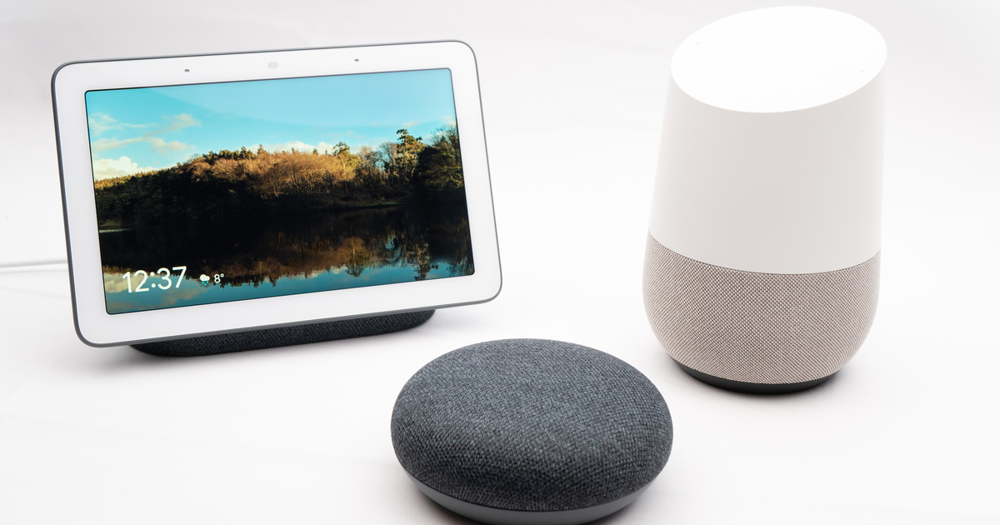
   
</img>
OOGLE
HOME,
NEST

Рисунок
2 – Устройства Google

Параллельно
Google
создавал свою платформу для конкуренции.
В марте 2016 появились первые слухи о
разработке устройства-конкурента Echo,
а весной того же года на конференции
Google
I/O
был анонсирован Google
Home
с голосовым Assistant.
Ассистент развился из Google
Now
в полноценную систему распознавания и
обработки команд. Первая модель была
выпущена в ноябре 2016 в США, затем
стартовали продажи в Великобритании и
по всему миру. В конце 2017 года Google
представил Home
Mini
и Home
Max,
затем Nest
Hub
с экраном в 2019, позже Hub
Max
с камерой. В 2019 компания объединила свои
умные устройства под брендом Nest.
Устройства получили поддержку стандартов
Thread
и Matter,
была начата миграция операционной
системы экрана на Fuchsia.
Несмотря на техногенное превосходство,
Google
отмечалась критика по вопросам
конфиденциальности: утечка записей с
устройств указывала на проблемы в записи
аудио питаниями, что вызвало расследования.
Тем не менее, платформа Nest
продолжает развиваться, и в 2025 году
замечен экранный прототип нового
устройства с поддержкой Gemini
AI,
возможно, заменяющего Google
Assistant
на Nest&#8209;устройствах.

APPLE
HOMEPOD

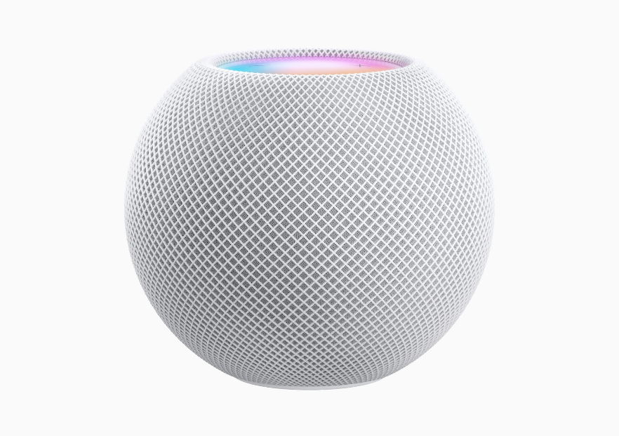

Рисунок
3 – Apple
Homepod

Apple
вошла в рынок умных колонок чуть позже.
Анонс HomePod
состоялся на WWDC
в июне 2017, продажи начались в январе&#8209;феврале
2018. Это была колонка премиум&#8209;класса,
с акцентом на звук: процессор A8,
семь твиттеров, сабвуфер, массив
микрофонов и тесная интеграция с AirPlay
2 и HomeKit
и экосистемой Apple.
К марту 2021 было прекращено производство
первой HomePod&#8209;версии,
сосредоточившись на более доступной
HomePod
mini,
анонсированной в октябре&#8209;ноябре
2020, с чипом S5,
U1,
LED&#8209;индикатором
и AirPlay
2, ценой около 99 долларов. В январе 2023
Apple
представила HomePod
второго поколения с улучшенным звуком,
поддержкой Matter,
Thread
и датчиками окружающей среды, анонс был
сделан за $299. В 2025 ожидается выпуск новой
версии HomePod
с экраном, чипом A18,
FaceTime,
Apple
Intelligence,
усилением функциональности Siri
и расширения взаимодействий.

Y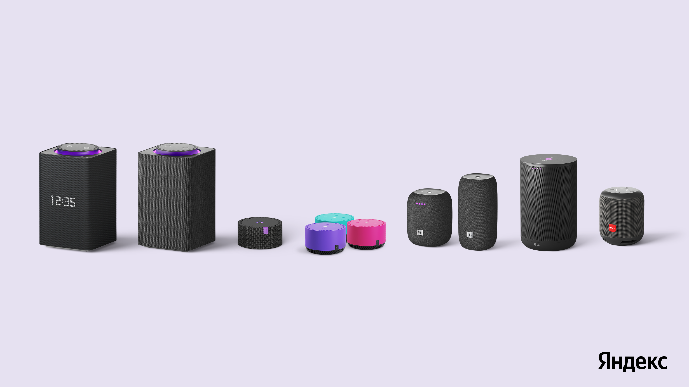
   
</img>
ANDEX
STATION

Рисунок
4 – Устройства Yandex

Яндекс
занял своё место на рынке России и СНГ.
Голосовой ассистент Алиса был запущен
в октябре 2017 в мобильных приложениях,
а дебют умной колонки Yandex.Station
состоялся в мае 2018 на конференции Yet
Another
Conference.
Устройство было первой попыткой вывести
локализованную, говорящую на русском
языке, умную колонку. Станция имела семь
микрофонов и 50 Вт звука, поддерживала
аудио и видео стриминг на телевизор
через HDMI.
Затем последовали Station
Mini
(2019) с жестовым управлением, Station
Max
(2020) с LED&#8209;экраном
и мощностью 65 Вт, Station
2 (2022) с LED&#8209;панелью
и 360° звуком, улучшенным акустическим
дизайном и коррекцией звука. В 2023
появились Midi,
с нейропроцессором, офлайн&#8209;Zigbee
и эмо&#8209;индикатором, и Duo
Max
с поворотным Full
HD
экраном и камерой 13 Мп. В 2025 выпущены
Light
2 – доступная модель с Matter
и аккумулятором, и Street
– портативная колонка с IP67,
автономной работой и AI&#8209;функциями
без интернета. Яндекс также развивал
экосистему устройств, включая сторонние
производители (Irbis,
DEXP)
и платформу Yandex.IO,
интеграции с Алиса&#8209;сервисами: музыка,
такси, доставка, сценарии умного дома.
В 2024 добавлена персонализация контента
на Station
TV
по профилям пользователей.

ВК
КАПСУЛА

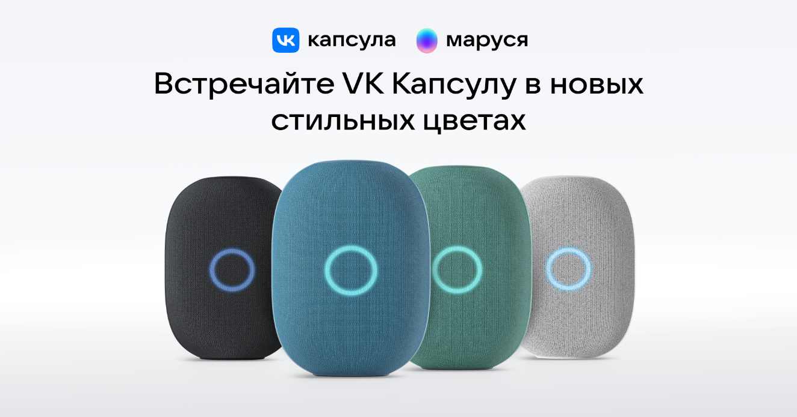

Рисунок
5 – ВК Капсула

VK
Капсула – умная колонка, разработанная
VK
и выпущенная в 2020 году как аппаратное
дополнение к экосистеме сервисов VK
(включая VK
Music
и мессенджеры). Цель устройства – дать
пользователям быстрый голосовой доступ
к аудиоконтенту VK,
уведомлениям и базовым функциям умного
дома. Аппаратно это типичная для рынка
умная колонка: многоэлементная система
динамиков, набор микрофонов для
распознавания речи, модули Wi&#8209;Fi/Bluetooth
и встроенное ПО для голосового управления
и интеграции с сервисами VK.

Проект
не ставил целью конкурировать по масштабу
с международными игроками, ориентировался
на лояльную русскоязычную аудиторию,
глубоко интегрированную в экосистему
VK.
Функции: воспроизведение музыки из VK
Music,
воспроизведение подкастов, голосовые
уведомления, простые голосовые команды
и взаимодействие с чат&#8209;ботами
сообществ. Технические и программные
обновления происходили в рамках поддержки
сервисов VK,
но серьёзных уникальных аппаратных
инноваций не было.

Коммерческий
результат и распространение оказались
скромными. VK
Станция занимала нишевую позицию и в
основном использовалась активными
пользователями VK
и подписчиками музыкального сервиса.
Впоследствии VK
сместила фокус к развитию сервисов и
приложений, что привело к сокращению
инициатив в области собственной
электроники.

Таблица
1 – Сравнение аналогов

<table width="100%" cellpadding="4" cellspacing="0">
	<col width="39*"/>
	<col width="45*"/>
	<col width="58*"/>
	<col width="51*"/>
	<col width="38*"/>
	<col width="26*"/>
	<tr valign="top">
		<td width="15%" style="border-top: 1px solid #000000; border-bottom: 1px solid #000000; border-left: 1px solid #000000; border-right: none; padding-top: 0.97mm; padding-bottom: 0.97mm; padding-left: 0.97mm; padding-right: 0mm">

			Модель

		</td>
		<td width="18%" style="border-top: 1px solid #000000; border-bottom: 1px solid #000000; border-left: 1px solid #000000; border-right: none; padding-top: 0.97mm; padding-bottom: 0.97mm; padding-left: 0.97mm; padding-right: 0mm">

			Социально-экономические
			показатели

		</td>
		<td width="23%" style="border-top: 1px solid #000000; border-bottom: 1px solid #000000; border-left: 1px solid #000000; border-right: none; padding-top: 0.97mm; padding-bottom: 0.97mm; padding-left: 0.97mm; padding-right: 0mm">

			Функциональность

		</td>
		<td width="20%" style="border-top: 1px solid #000000; border-bottom: 1px solid #000000; border-left: 1px solid #000000; border-right: none; padding-top: 0.97mm; padding-bottom: 0.97mm; padding-left: 0.97mm; padding-right: 0mm">

			Технологичность

		</td>
		<td width="15%" style="border-top: 1px solid #000000; border-bottom: 1px solid #000000; border-left: 1px solid #000000; border-right: none; padding-top: 0.97mm; padding-bottom: 0.97mm; padding-left: 0.97mm; padding-right: 0mm">

			Эстетичность

		</td>
		<td width="10%" style="border: 1px solid #000000; padding: 0.97mm">

			Итого:

		</td>
	</tr>
	<tr valign="top">
		<td width="15%" style="border-top: none; border-bottom: 1px solid #000000; border-left: 1px solid #000000; border-right: none; padding-top: 0mm; padding-bottom: 0.97mm; padding-left: 0.97mm; padding-right: 0mm">

			Amazon
			Echo

		</td>
		<td width="18%" style="border-top: none; border-bottom: 1px solid #000000; border-left: 1px solid #000000; border-right: none; padding-top: 0mm; padding-bottom: 0.97mm; padding-left: 0.97mm; padding-right: 0mm">

			3

		</td>
		<td width="23%" style="border-top: none; border-bottom: 1px solid #000000; border-left: 1px solid #000000; border-right: none; padding-top: 0mm; padding-bottom: 0.97mm; padding-left: 0.97mm; padding-right: 0mm">

			4

		</td>
		<td width="20%" style="border-top: none; border-bottom: 1px solid #000000; border-left: 1px solid #000000; border-right: none; padding-top: 0mm; padding-bottom: 0.97mm; padding-left: 0.97mm; padding-right: 0mm">

			4

		</td>
		<td width="15%" style="border-top: none; border-bottom: 1px solid #000000; border-left: 1px solid #000000; border-right: none; padding-top: 0mm; padding-bottom: 0.97mm; padding-left: 0.97mm; padding-right: 0mm">

			2

		</td>
		<td width="10%" style="border-top: none; border-bottom: 1px solid #000000; border-left: 1px solid #000000; border-right: 1px solid #000000; padding-top: 0mm; padding-bottom: 0.97mm; padding-left: 0.97mm; padding-right: 0.97mm">

			13

		</td>
	</tr>
	<tr valign="top">
		<td width="15%" style="border-top: none; border-bottom: 1px solid #000000; border-left: 1px solid #000000; border-right: none; padding-top: 0mm; padding-bottom: 0.97mm; padding-left: 0.97mm; padding-right: 0mm">

			Google
			Nest

		</td>
		<td width="18%" style="border-top: none; border-bottom: 1px solid #000000; border-left: 1px solid #000000; border-right: none; padding-top: 0mm; padding-bottom: 0.97mm; padding-left: 0.97mm; padding-right: 0mm">

			3

		</td>
		<td width="23%" style="border-top: none; border-bottom: 1px solid #000000; border-left: 1px solid #000000; border-right: none; padding-top: 0mm; padding-bottom: 0.97mm; padding-left: 0.97mm; padding-right: 0mm">

			4

		</td>
		<td width="20%" style="border-top: none; border-bottom: 1px solid #000000; border-left: 1px solid #000000; border-right: none; padding-top: 0mm; padding-bottom: 0.97mm; padding-left: 0.97mm; padding-right: 0mm">

			4

		</td>
		<td width="15%" style="border-top: none; border-bottom: 1px solid #000000; border-left: 1px solid #000000; border-right: none; padding-top: 0mm; padding-bottom: 0.97mm; padding-left: 0.97mm; padding-right: 0mm">

			3

		</td>
		<td width="10%" style="border-top: none; border-bottom: 1px solid #000000; border-left: 1px solid #000000; border-right: 1px solid #000000; padding-top: 0mm; padding-bottom: 0.97mm; padding-left: 0.97mm; padding-right: 0.97mm">

			14

		</td>
	</tr>
	<tr valign="top">
		<td width="15%" style="border-top: none; border-bottom: 1px solid #000000; border-left: 1px solid #000000; border-right: none; padding-top: 0mm; padding-bottom: 0.97mm; padding-left: 0.97mm; padding-right: 0mm">

			Apple
			HomePod

		</td>
		<td width="18%" style="border-top: none; border-bottom: 1px solid #000000; border-left: 1px solid #000000; border-right: none; padding-top: 0mm; padding-bottom: 0.97mm; padding-left: 0.97mm; padding-right: 0mm">

			2

		</td>
		<td width="23%" style="border-top: none; border-bottom: 1px solid #000000; border-left: 1px solid #000000; border-right: none; padding-top: 0mm; padding-bottom: 0.97mm; padding-left: 0.97mm; padding-right: 0mm">

			3

		</td>
		<td width="20%" style="border-top: none; border-bottom: 1px solid #000000; border-left: 1px solid #000000; border-right: none; padding-top: 0mm; padding-bottom: 0.97mm; padding-left: 0.97mm; padding-right: 0mm">

			5

		</td>
		<td width="15%" style="border-top: none; border-bottom: 1px solid #000000; border-left: 1px solid #000000; border-right: none; padding-top: 0mm; padding-bottom: 0.97mm; padding-left: 0.97mm; padding-right: 0mm">

			4

		</td>
		<td width="10%" style="border-top: none; border-bottom: 1px solid #000000; border-left: 1px solid #000000; border-right: 1px solid #000000; padding-top: 0mm; padding-bottom: 0.97mm; padding-left: 0.97mm; padding-right: 0.97mm">

			14

		</td>
	</tr>
	<tr valign="top">
		<td width="15%" style="border-top: none; border-bottom: 1px solid #000000; border-left: 1px solid #000000; border-right: none; padding-top: 0mm; padding-bottom: 0.97mm; padding-left: 0.97mm; padding-right: 0mm">

			Yandex
			Station

		</td>
		<td width="18%" style="border-top: none; border-bottom: 1px solid #000000; border-left: 1px solid #000000; border-right: none; padding-top: 0mm; padding-bottom: 0.97mm; padding-left: 0.97mm; padding-right: 0mm">

			3

		</td>
		<td width="23%" style="border-top: none; border-bottom: 1px solid #000000; border-left: 1px solid #000000; border-right: none; padding-top: 0mm; padding-bottom: 0.97mm; padding-left: 0.97mm; padding-right: 0mm">

			4

		</td>
		<td width="20%" style="border-top: none; border-bottom: 1px solid #000000; border-left: 1px solid #000000; border-right: none; padding-top: 0mm; padding-bottom: 0.97mm; padding-left: 0.97mm; padding-right: 0mm">

			3

		</td>
		<td width="15%" style="border-top: none; border-bottom: 1px solid #000000; border-left: 1px solid #000000; border-right: none; padding-top: 0mm; padding-bottom: 0.97mm; padding-left: 0.97mm; padding-right: 0mm">

			3

		</td>
		<td width="10%" style="border-top: none; border-bottom: 1px solid #000000; border-left: 1px solid #000000; border-right: 1px solid #000000; padding-top: 0mm; padding-bottom: 0.97mm; padding-left: 0.97mm; padding-right: 0.97mm">

			13

		</td>
	</tr>
	<tr valign="top">
		<td width="15%" style="border-top: none; border-bottom: 1px solid #000000; border-left: 1px solid #000000; border-right: none; padding-top: 0mm; padding-bottom: 0.97mm; padding-left: 0.97mm; padding-right: 0mm">

			VK
			Капсула

		</td>
		<td width="18%" style="border-top: none; border-bottom: 1px solid #000000; border-left: 1px solid #000000; border-right: none; padding-top: 0mm; padding-bottom: 0.97mm; padding-left: 0.97mm; padding-right: 0mm">

			4

		</td>
		<td width="23%" style="border-top: none; border-bottom: 1px solid #000000; border-left: 1px solid #000000; border-right: none; padding-top: 0mm; padding-bottom: 0.97mm; padding-left: 0.97mm; padding-right: 0mm">

			2

		</td>
		<td width="20%" style="border-top: none; border-bottom: 1px solid #000000; border-left: 1px solid #000000; border-right: none; padding-top: 0mm; padding-bottom: 0.97mm; padding-left: 0.97mm; padding-right: 0mm">

			3

		</td>
		<td width="15%" style="border-top: none; border-bottom: 1px solid #000000; border-left: 1px solid #000000; border-right: none; padding-top: 0mm; padding-bottom: 0.97mm; padding-left: 0.97mm; padding-right: 0mm">

			2

		</td>
		<td width="10%" style="border-top: none; border-bottom: 1px solid #000000; border-left: 1px solid #000000; border-right: 1px solid #000000; padding-top: 0mm; padding-bottom: 0.97mm; padding-left: 0.97mm; padding-right: 0.97mm">

			11

		</td>
	</tr>
</table>
<h2 class="western" align="justify" style="line-height: 150%">
1.5.
Выводы и рекомендации по первой главе</h2>

История
разработки умных колонок претерпела
значительные изменения, определяемые
несколькими направлениями. Первое –
интеграция с голосовыми помощниками,
что улучшило обработку естественного
языка и повысило функциональность.
Качество звука также стало приоритетом
с появлением моделей, как Sonos One, с
высококачественными динамиками. Второе
— включение в концепцию умного дома и
Интернета вещей (IoT), где колонки становятся
центрами управления для различных
устройств. В условиях заботы о
конфиденциальности разработчики начали
внедрять шифрование и локальное хранение
данных. Третье – изменения в дизайне,
где умные колонки становятся стильными
элементами интерьера. Современные
устройства часто интегрируют функции
колонок с телевизорами и системами
кинотеатров, расширяя языковую поддержку
для широкой аудитории. Машинное обучение
помогает колонкам адаптироваться к
привычкам пользователей. Также возрастает
интерес к локальным решениям для
повышения скорости работы и защиты
конфиденциальности, а производители
исследуют использование экологически
чистых материалов.

Лучшими
идеями являются: конструктор функций,
интеграция с умным домом, поддержка
множества протоколов, физическое
отключение микрофона, грамотная
интеграция с экосистемой, контекстно
направленный искусственный интеллект,
развитая мультимедийная архитектура
и качественный звук. Худшими идеями
считаются: привязанность к аккаунту,
жесткая привязка к экосистеме, плохая
поддержка локализованных сервисов,
подписочное рабство, жесткая зависимость
от облака, плохая поддержка, закрытая
система и хранение истории запросов,
которая может утечь в руки злоумышленников.

<ol start="3">
	<li><h1 class="western" align="justify" style="margin-top: 0mm; line-height: 150%; page-break-before: always">
	ГЛАВА
	II
	– «КОНСТРУКТОРСКО-ТЕХНОЛОГИЧЕСКИЙ
	ЭТАП»</h1></li>
</ol>
<h2 class="western" align="justify" style="line-height: 150%">
2.1.
Описание устройства</h2>

Я
позиционирую свое устройство как
универсальный мультимедийный центр
для любого пользователя, отвечающий
его требованиям. Поскольку у каждого
взгляд на то, как должен выглядеть
мультимедийный центр разный, я решил
делать дизайн различным, в зависимости
от потребностей пользователя. Для этого
я разработал универсальный каркас, к
которому крепятся компоненты устройства,
и внешние корпуса, среди которых
пользователь сможет выбрать наиболее
подходящий. Так, при заказе моего
устройства пользователю будут предложены
различные варианты корпусов. И в
дальнейшем, если пользователю наскучит
дизайн, он сможет заказать новый корпус
и его интерьер заиграет новыми красками.

Модульность
– это особенность, позволяющая проекту
развиваться, добавляя новые аппаратные
модули или заменяя предыдущие, чтобы
устройство всегда оставалось актуальным
и дарило пользователю удовольствие как
можно большее время. В качестве удачного
примера модульности могу привести
феномен ноутбуков линейки ThinkPad.
Они были передовыми устройствами, при
этом в них можно легко заменить практически
любой элемент. За это их коллекционируют,
любят, используют до сих пор десятки
тысяч пользователей, используют на
Международной Космической Станции и
космических шаттлах. Модульность в моем
проекте позволит пользователю ставить
дополнительные модули, исходя из его
потребностей.

Инструкция
по использованию находится в приложении
А.

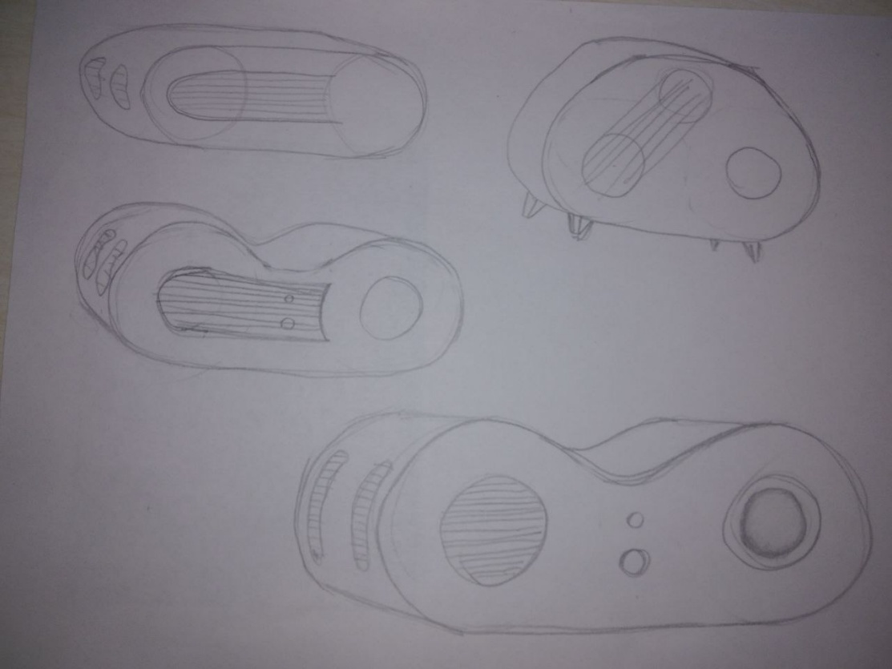

Рисунок
6 – Эскизы устройства

<b>Линейка
Устройств</b>

Основное
устройство: выполняет все заявленные
функции локально.

Упрощенное
устройство (в разработке): Обработка
данных производится на личном сервере
пользователя (который можно предоставлять
со скидкой от хостинга, если с ним
договориться о сотрудничестве). Скорее
всего не будет воспроизведения видео,
максимум – подключение стороннего
дисплея с минимальной тяжестью отрисовки
графики. Так, стоимость электровычислительных
компонентов снижается в несколько раз,
однако пользователь либо покупает
вычислительные мощности, либо развертывает
у себя дома или в офисе сервер
самостоятельно.

<b>Дополнительные
модули: </b>

<ol>
	<li>
Проектор.
	Внешний модуль, позволяющий максимально
	эффективно проецировать изображение
	на стену. В основной версии устройства
	изображение будет воспроизводиться
	либо на телевизор, либо на внешний
	дисплей, либо проецироваться на стену.
	Для
	этого разрабатывается графическая
	оболочка. 
	
</li>
	<li>
Камера.
	С помощью камеры можно будет следить
	за происходящим в доме (канал будет
	надежно зашифрован), управлять устройством
	с помощью жестов (планируется).
</li>
	<li>
Антенны,
	для выполнения функций роутера (в
	разработке). Функция роутера – идея
	использования моего умного устройства
	как интернет-центр. Это глобальная
	идея. Сейчас поток даных идет от умного
	устройства (допустим, лампочки) к роутеру
	и потом к центру умного дома. Когда
	центр умного дома станет и центром
	распределения трафика (роутером), умным
	домом будет легче управлять и легче
	устанавливать. 
	
</li>
	<li>
Внешний
	дисплей. Необходим для показа краткой
	или полной информации в зависимости
	от его размера.
</li>
	<li>
Кастомные
	корпуса
</li>
	<li>
Датчики
	температуры, влажности, уровня углекислого
	газа
</li>
</ol>

<b>Стратегия
продвижения:</b>

<ul>
	<li>

	Сообщество:
	GitHub, форумы, Habr Telegram, хакатоны.
</li>
	<li>

	Контент-маркетинг:
	блоги о приватности и кибер-безопасности,
	инструкции по интеграции, видео с
	демонстрациями.
</li>
	<li>
Партнёрства
	с российскими сервисами
</li>
</ul>

<b>Функции</b>

Таблица
2 – Функции

<table width="701" cellpadding="4" cellspacing="0">
	<col width="219"/>
	<col width="337"/>
	<col width="118"/>
	<tr valign="top">
		<td width="219" style="border-top: 1px solid #000000; border-bottom: 1px solid #000000; border-left: 1px solid #000000; border-right: none; padding-top: 0.97mm; padding-bottom: 0.97mm; padding-left: 0.97mm; padding-right: 0mm">

			Функция

		</td>
		<td width="337" style="border-top: 1px solid #000000; border-bottom: 1px solid #000000; border-left: 1px solid #000000; border-right: none; padding-top: 0.97mm; padding-bottom: 0.97mm; padding-left: 0.97mm; padding-right: 0mm">

			Реализация

		</td>
		<td width="118" style="border: 1px solid #000000; padding: 0.97mm">

			Статус

		</td>
	</tr>
	<tr valign="top">
		<td width="219" style="border-top: none; border-bottom: 1px solid #000000; border-left: 1px solid #000000; border-right: none; padding-top: 0mm; padding-bottom: 0.97mm; padding-left: 0.97mm; padding-right: 0mm">

			STT
			(speech
			to
			text
			– преобразование речи в текст)

		</td>
		<td width="337" style="border-top: none; border-bottom: 1px solid #000000; border-left: 1px solid #000000; border-right: none; padding-top: 0mm; padding-bottom: 0.97mm; padding-left: 0.97mm; padding-right: 0mm">

			Через
			python-библиотеку
			vosk
			используется упрощенная локальная
			нейросеть.

		</td>
		<td width="118" style="border-top: none; border-bottom: 1px solid #000000; border-left: 1px solid #000000; border-right: 1px solid #000000; padding-top: 0mm; padding-bottom: 0.97mm; padding-left: 0.97mm; padding-right: 0.97mm">

			готово

		</td>
	</tr>
	<tr valign="top">
		<td width="219" style="border-top: none; border-bottom: 1px solid #000000; border-left: 1px solid #000000; border-right: none; padding-top: 0mm; padding-bottom: 0.97mm; padding-left: 0.97mm; padding-right: 0mm">

			TTS
			(text
			to
			speech
			– преобразование текста в речь)

		</td>
		<td width="337" style="border-top: none; border-bottom: 1px solid #000000; border-left: 1px solid #000000; border-right: none; padding-top: 0mm; padding-bottom: 0.97mm; padding-left: 0.97mm; padding-right: 0mm">

			Через
			python-библиотеку
			piper
			используется локальная нейросеть
			синтеза голоса.

		</td>
		<td width="118" style="border-top: none; border-bottom: 1px solid #000000; border-left: 1px solid #000000; border-right: 1px solid #000000; padding-top: 0mm; padding-bottom: 0.97mm; padding-left: 0.97mm; padding-right: 0.97mm">

			готово

		</td>
	</tr>
	<tr valign="top">
		<td width="219" style="border-top: none; border-bottom: 1px solid #000000; border-left: 1px solid #000000; border-right: none; padding-top: 0mm; padding-bottom: 0.97mm; padding-left: 0.97mm; padding-right: 0mm">

			стриминг
			музыки, любого другого аудио и видео

		</td>
		<td width="337" style="border-top: none; border-bottom: 1px solid #000000; border-left: 1px solid #000000; border-right: none; padding-top: 0mm; padding-bottom: 0.97mm; padding-left: 0.97mm; padding-right: 0mm">

			Через
			python-библиотеку
			pytube
			производится парсинг youtube
			выводится список первых пяти видео
			по запросу (можно больше), далее
			пользователь выбирает видео/аудио и
			ссылка открывается в mpv,
			который умеет стримить видео.

		</td>
		<td width="118" style="border-top: none; border-bottom: 1px solid #000000; border-left: 1px solid #000000; border-right: 1px solid #000000; padding-top: 0mm; padding-bottom: 0.97mm; padding-left: 0.97mm; padding-right: 0.97mm">

			готово

		</td>
	</tr>
	<tr valign="top">
		<td width="219" style="border-top: none; border-bottom: 1px solid #000000; border-left: 1px solid #000000; border-right: none; padding-top: 0mm; padding-bottom: 0.97mm; padding-left: 0.97mm; padding-right: 0mm">

			локальная
			языковая модель (нейросеть)

		</td>
		<td width="337" style="border-top: none; border-bottom: 1px solid #000000; border-left: 1px solid #000000; border-right: none; padding-top: 0mm; padding-bottom: 0.97mm; padding-left: 0.97mm; padding-right: 0mm">

			Python-библиотека
			ollama
			обращается к программе Ollama,
			которая запускает локальную языковую
			модель и пользователь может с ней
			общаться. При этом я реализовал алгоритм
			динамического преобразования ответа
			в голос, то есть ответ озвучивается
			по ходу генерации, в реальном времени.

		</td>
		<td width="118" style="border-top: none; border-bottom: 1px solid #000000; border-left: 1px solid #000000; border-right: 1px solid #000000; padding-top: 0mm; padding-bottom: 0.97mm; padding-left: 0.97mm; padding-right: 0.97mm">

			готово

		</td>
	</tr>
	<tr valign="top">
		<td width="219" style="border-top: none; border-bottom: 1px solid #000000; border-left: 1px solid #000000; border-right: none; padding-top: 0mm; padding-bottom: 0.97mm; padding-left: 0.97mm; padding-right: 0mm">

			зачитывание
			последних новостей

		</td>
		<td width="337" style="border-top: none; border-bottom: 1px solid #000000; border-left: 1px solid #000000; border-right: none; padding-top: 0mm; padding-bottom: 0.97mm; padding-left: 0.97mm; padding-right: 0mm">

			Используются
			python-библиотеки
			requests
			и bs4
			для парсинга последних новостей с
			новостных ресурсов. При
			запросе устройство может зачитать
			текст статьи.

		</td>
		<td width="118" style="border-top: none; border-bottom: 1px solid #000000; border-left: 1px solid #000000; border-right: 1px solid #000000; padding-top: 0mm; padding-bottom: 0.97mm; padding-left: 0.97mm; padding-right: 0.97mm">

			готово

		</td>
	</tr>
	<tr valign="top">
		<td width="219" style="border-top: none; border-bottom: 1px solid #000000; border-left: 1px solid #000000; border-right: none; padding-top: 0mm; padding-bottom: 0.97mm; padding-left: 0.97mm; padding-right: 0mm">

			установка
			будильника

		</td>
		<td width="337" style="border-top: none; border-bottom: 1px solid #000000; border-left: 1px solid #000000; border-right: none; padding-top: 0mm; padding-bottom: 0.97mm; padding-left: 0.97mm; padding-right: 0mm">

			Используется
			стандартная python-библиотека
			time.

		</td>
		<td width="118" style="border-top: none; border-bottom: 1px solid #000000; border-left: 1px solid #000000; border-right: 1px solid #000000; padding-top: 0mm; padding-bottom: 0.97mm; padding-left: 0.97mm; padding-right: 0.97mm">

			готово

		</td>
	</tr>
	<tr valign="top">
		<td width="219" style="border-top: none; border-bottom: 1px solid #000000; border-left: 1px solid #000000; border-right: none; padding-top: 0mm; padding-bottom: 0.97mm; padding-left: 0.97mm; padding-right: 0mm">

			создание
			списка задач

		</td>
		<td width="337" style="border-top: none; border-bottom: 1px solid #000000; border-left: 1px solid #000000; border-right: none; padding-top: 0mm; padding-bottom: 0.97mm; padding-left: 0.97mm; padding-right: 0mm">

			Данные
			записываются в json-файл.

		</td>
		<td width="118" style="border-top: none; border-bottom: 1px solid #000000; border-left: 1px solid #000000; border-right: 1px solid #000000; padding-top: 0mm; padding-bottom: 0.97mm; padding-left: 0.97mm; padding-right: 0.97mm">

			готово

		</td>
	</tr>
	<tr valign="top">
		<td width="219" style="border-top: none; border-bottom: 1px solid #000000; border-left: 1px solid #000000; border-right: none; padding-top: 0mm; padding-bottom: 0.97mm; padding-left: 0.97mm; padding-right: 0mm">

			информация
			о погоде

		</td>
		<td width="337" style="border-top: none; border-bottom: 1px solid #000000; border-left: 1px solid #000000; border-right: none; padding-top: 0mm; padding-bottom: 0.97mm; padding-left: 0.97mm; padding-right: 0mm">

			Используются
			python-библиотеки requests и bs4 для парсинга
			данных с openweathermap.

		</td>
		<td width="118" style="border-top: none; border-bottom: 1px solid #000000; border-left: 1px solid #000000; border-right: 1px solid #000000; padding-top: 0mm; padding-bottom: 0.97mm; padding-left: 0.97mm; padding-right: 0.97mm">

			готово

		</td>
	</tr>
	<tr valign="top">
		<td width="219" style="border-top: none; border-bottom: 1px solid #000000; border-left: 1px solid #000000; border-right: none; padding-top: 0mm; padding-bottom: 0.97mm; padding-left: 0.97mm; padding-right: 0mm">

			ведение
			заметок

		</td>
		<td width="337" style="border-top: none; border-bottom: 1px solid #000000; border-left: 1px solid #000000; border-right: none; padding-top: 0mm; padding-bottom: 0.97mm; padding-left: 0.97mm; padding-right: 0mm">

			Данные
			записываются в json-файл.

		</td>
		<td width="118" style="border-top: none; border-bottom: 1px solid #000000; border-left: 1px solid #000000; border-right: 1px solid #000000; padding-top: 0mm; padding-bottom: 0.97mm; padding-left: 0.97mm; padding-right: 0.97mm">

			готово

		</td>
	</tr>
	<tr valign="top">
		<td width="219" style="border-top: none; border-bottom: 1px solid #000000; border-left: 1px solid #000000; border-right: none; padding-top: 0mm; padding-bottom: 0.97mm; padding-left: 0.97mm; padding-right: 0mm">

			поиск
			информации в wikipedia

		</td>
		<td width="337" style="border-top: none; border-bottom: 1px solid #000000; border-left: 1px solid #000000; border-right: none; padding-top: 0mm; padding-bottom: 0.97mm; padding-left: 0.97mm; padding-right: 0mm">

			Используется
			python-библиотека
			wikipedia
			для парсинга с сайта википедии.

		</td>
		<td width="118" style="border-top: none; border-bottom: 1px solid #000000; border-left: 1px solid #000000; border-right: 1px solid #000000; padding-top: 0mm; padding-bottom: 0.97mm; padding-left: 0.97mm; padding-right: 0.97mm">

			готово

		</td>
	</tr>
	<tr valign="top">
		<td width="219" style="border-top: none; border-bottom: 1px solid #000000; border-left: 1px solid #000000; border-right: none; padding-top: 0mm; padding-bottom: 0.97mm; padding-left: 0.97mm; padding-right: 0mm">

			составление
			маршрута

		</td>
		<td width="337" style="border-top: none; border-bottom: 1px solid #000000; border-left: 1px solid #000000; border-right: none; padding-top: 0mm; padding-bottom: 0.97mm; padding-left: 0.97mm; padding-right: 0mm">

			-

		</td>
		<td width="118" style="border-top: none; border-bottom: 1px solid #000000; border-left: 1px solid #000000; border-right: 1px solid #000000; padding-top: 0mm; padding-bottom: 0.97mm; padding-left: 0.97mm; padding-right: 0.97mm">

			В
			активной разработке

		</td>
	</tr>
	<tr valign="top">
		<td width="219" style="border-top: none; border-bottom: 1px solid #000000; border-left: 1px solid #000000; border-right: none; padding-top: 0mm; padding-bottom: 0.97mm; padding-left: 0.97mm; padding-right: 0mm">

			просмотр
			расписания общественного транспорта

		</td>
		<td width="337" style="border-top: none; border-bottom: 1px solid #000000; border-left: 1px solid #000000; border-right: none; padding-top: 0mm; padding-bottom: 0.97mm; padding-left: 0.97mm; padding-right: 0mm">

			-

		</td>
		<td width="118" style="border-top: none; border-bottom: 1px solid #000000; border-left: 1px solid #000000; border-right: 1px solid #000000; padding-top: 0mm; padding-bottom: 0.97mm; padding-left: 0.97mm; padding-right: 0.97mm">

			В
			активной разработке

		</td>
	</tr>
	<tr valign="top">
		<td width="219" style="border-top: none; border-bottom: 1px solid #000000; border-left: 1px solid #000000; border-right: none; padding-top: 0mm; padding-bottom: 0.97mm; padding-left: 0.97mm; padding-right: 0mm">

			тренировки

		</td>
		<td width="337" style="border-top: none; border-bottom: 1px solid #000000; border-left: 1px solid #000000; border-right: none; padding-top: 0mm; padding-bottom: 0.97mm; padding-left: 0.97mm; padding-right: 0mm">

			-

		</td>
		<td width="118" style="border-top: none; border-bottom: 1px solid #000000; border-left: 1px solid #000000; border-right: 1px solid #000000; padding-top: 0mm; padding-bottom: 0.97mm; padding-left: 0.97mm; padding-right: 0.97mm">

			В
			активной разработке

		</td>
	</tr>
	<tr valign="top">
		<td width="219" style="border-top: none; border-bottom: 1px solid #000000; border-left: 1px solid #000000; border-right: none; padding-top: 0mm; padding-bottom: 0.97mm; padding-left: 0.97mm; padding-right: 0mm">

			графическая
			оболочка

		</td>
		<td width="337" style="border-top: none; border-bottom: 1px solid #000000; border-left: 1px solid #000000; border-right: none; padding-top: 0mm; padding-bottom: 0.97mm; padding-left: 0.97mm; padding-right: 0mm">

			Отрисовка
			графики через xorg,
			интерфейс на основе kodi.

		</td>
		<td width="118" style="border-top: none; border-bottom: 1px solid #000000; border-left: 1px solid #000000; border-right: 1px solid #000000; padding-top: 0mm; padding-bottom: 0.97mm; padding-left: 0.97mm; padding-right: 0.97mm">

			В
			активной разработке

		</td>
	</tr>
	<tr valign="top">
		<td width="219" style="border-top: none; border-bottom: 1px solid #000000; border-left: 1px solid #000000; border-right: none; padding-top: 0mm; padding-bottom: 0.97mm; padding-left: 0.97mm; padding-right: 0mm">

			Сборник
			рецептов

		</td>
		<td width="337" style="border-top: none; border-bottom: 1px solid #000000; border-left: 1px solid #000000; border-right: none; padding-top: 0mm; padding-bottom: 0.97mm; padding-left: 0.97mm; padding-right: 0mm">

			-

		</td>
		<td width="118" style="border-top: none; border-bottom: 1px solid #000000; border-left: 1px solid #000000; border-right: 1px solid #000000; padding-top: 0mm; padding-bottom: 0.97mm; padding-left: 0.97mm; padding-right: 0.97mm">

			В
			активной разработке

		</td>
	</tr>
	<tr valign="top">
		<td width="219" style="border-top: none; border-bottom: 1px solid #000000; border-left: 1px solid #000000; border-right: none; padding-top: 0mm; padding-bottom: 0.97mm; padding-left: 0.97mm; padding-right: 0mm">

			Управление
			умным домом

		</td>
		<td width="337" style="border-top: none; border-bottom: 1px solid #000000; border-left: 1px solid #000000; border-right: none; padding-top: 0mm; padding-bottom: 0.97mm; padding-left: 0.97mm; padding-right: 0mm">

			-

		</td>
		<td width="118" style="border-top: none; border-bottom: 1px solid #000000; border-left: 1px solid #000000; border-right: 1px solid #000000; padding-top: 0mm; padding-bottom: 0.97mm; padding-left: 0.97mm; padding-right: 0.97mm">

			В
			активной разработке

		</td>
	</tr>
	<tr valign="top">
		<td width="219" style="border-top: none; border-bottom: 1px solid #000000; border-left: 1px solid #000000; border-right: none; padding-top: 0mm; padding-bottom: 0.97mm; padding-left: 0.97mm; padding-right: 0mm">

			Датчики
			температуры, влажности, уровня
			углекислого газа

		</td>
		<td width="337" style="border-top: none; border-bottom: 1px solid #000000; border-left: 1px solid #000000; border-right: none; padding-top: 0mm; padding-bottom: 0.97mm; padding-left: 0.97mm; padding-right: 0mm">

			-

		</td>
		<td width="118" style="border-top: none; border-bottom: 1px solid #000000; border-left: 1px solid #000000; border-right: 1px solid #000000; padding-top: 0mm; padding-bottom: 0.97mm; padding-left: 0.97mm; padding-right: 0.97mm">

			В
			активной разработке

		</td>
	</tr>
	<tr valign="top">
		<td width="219" style="border-top: none; border-bottom: 1px solid #000000; border-left: 1px solid #000000; border-right: none; padding-top: 0mm; padding-bottom: 0.97mm; padding-left: 0.97mm; padding-right: 0mm">

			Караоке

		</td>
		<td width="337" style="border-top: none; border-bottom: 1px solid #000000; border-left: 1px solid #000000; border-right: none; padding-top: 0mm; padding-bottom: 0.97mm; padding-left: 0.97mm; padding-right: 0mm">

			-

		</td>
		<td width="118" style="border-top: none; border-bottom: 1px solid #000000; border-left: 1px solid #000000; border-right: 1px solid #000000; padding-top: 0mm; padding-bottom: 0.97mm; padding-left: 0.97mm; padding-right: 0.97mm">

			Неактивная
			разработка

		</td>
	</tr>
	<tr valign="top">
		<td width="219" style="border-top: none; border-bottom: 1px solid #000000; border-left: 1px solid #000000; border-right: none; padding-top: 0mm; padding-bottom: 0.97mm; padding-left: 0.97mm; padding-right: 0mm">

			Нейросеть
			для распознавания контекста

		</td>
		<td width="337" style="border-top: none; border-bottom: 1px solid #000000; border-left: 1px solid #000000; border-right: none; padding-top: 0mm; padding-bottom: 0.97mm; padding-left: 0.97mm; padding-right: 0mm">

			-

		</td>
		<td width="118" style="border-top: none; border-bottom: 1px solid #000000; border-left: 1px solid #000000; border-right: 1px solid #000000; padding-top: 0mm; padding-bottom: 0.97mm; padding-left: 0.97mm; padding-right: 0.97mm">

			Неактивная
			разработка

		</td>
	</tr>
	<tr valign="top">
		<td width="219" style="border-top: none; border-bottom: 1px solid #000000; border-left: 1px solid #000000; border-right: none; padding-top: 0mm; padding-bottom: 0.97mm; padding-left: 0.97mm; padding-right: 0mm">

			Управление
			жестами

		</td>
		<td width="337" style="border-top: none; border-bottom: 1px solid #000000; border-left: 1px solid #000000; border-right: none; padding-top: 0mm; padding-bottom: 0.97mm; padding-left: 0.97mm; padding-right: 0mm">

			-

		</td>
		<td width="118" style="border-top: none; border-bottom: 1px solid #000000; border-left: 1px solid #000000; border-right: 1px solid #000000; padding-top: 0mm; padding-bottom: 0.97mm; padding-left: 0.97mm; padding-right: 0.97mm">

			Неактивная
			разработка

		</td>
	</tr>
	<tr valign="top">
		<td width="219" style="border-top: none; border-bottom: 1px solid #000000; border-left: 1px solid #000000; border-right: none; padding-top: 0mm; padding-bottom: 0.97mm; padding-left: 0.97mm; padding-right: 0mm">

			Эмуляция
			игровых консолей

		</td>
		<td width="337" style="border-top: none; border-bottom: 1px solid #000000; border-left: 1px solid #000000; border-right: none; padding-top: 0mm; padding-bottom: 0.97mm; padding-left: 0.97mm; padding-right: 0mm">

			-

		</td>
		<td width="118" style="border-top: none; border-bottom: 1px solid #000000; border-left: 1px solid #000000; border-right: 1px solid #000000; padding-top: 0mm; padding-bottom: 0.97mm; padding-left: 0.97mm; padding-right: 0.97mm">

			Неактивная
			разработка

		</td>
	</tr>
	<tr valign="top">
		<td width="219" style="border-top: none; border-bottom: 1px solid #000000; border-left: 1px solid #000000; border-right: none; padding-top: 0mm; padding-bottom: 0.97mm; padding-left: 0.97mm; padding-right: 0mm">

			Локальный
			переводчик

		</td>
		<td width="337" style="border-top: none; border-bottom: 1px solid #000000; border-left: 1px solid #000000; border-right: none; padding-top: 0mm; padding-bottom: 0.97mm; padding-left: 0.97mm; padding-right: 0mm">

			Локальная
			нейросетевая модель libretranslate

		</td>
		<td width="118" style="border-top: none; border-bottom: 1px solid #000000; border-left: 1px solid #000000; border-right: 1px solid #000000; padding-top: 0mm; padding-bottom: 0.97mm; padding-left: 0.97mm; padding-right: 0.97mm">

			Неактивная
			разработка

		</td>
	</tr>
	<tr valign="top">
		<td width="219" style="border-top: none; border-bottom: 1px solid #000000; border-left: 1px solid #000000; border-right: none; padding-top: 0mm; padding-bottom: 0.97mm; padding-left: 0.97mm; padding-right: 0mm">

			Функции
			роутера

		</td>
		<td width="337" style="border-top: none; border-bottom: 1px solid #000000; border-left: 1px solid #000000; border-right: none; padding-top: 0mm; padding-bottom: 0.97mm; padding-left: 0.97mm; padding-right: 0mm">

			-

		</td>
		<td width="118" style="border-top: none; border-bottom: 1px solid #000000; border-left: 1px solid #000000; border-right: 1px solid #000000; padding-top: 0mm; padding-bottom: 0.97mm; padding-left: 0.97mm; padding-right: 0.97mm">

			Неактивная
			разработка

		</td>
	</tr>
	<tr valign="top">
		<td width="219" style="border-top: none; border-bottom: 1px solid #000000; border-left: 1px solid #000000; border-right: none; padding-top: 0mm; padding-bottom: 0.97mm; padding-left: 0.97mm; padding-right: 0mm">

			Торрент
			клиент

		</td>
		<td width="337" style="border-top: none; border-bottom: 1px solid #000000; border-left: 1px solid #000000; border-right: none; padding-top: 0mm; padding-bottom: 0.97mm; padding-left: 0.97mm; padding-right: 0mm">

			-

		</td>
		<td width="118" style="border-top: none; border-bottom: 1px solid #000000; border-left: 1px solid #000000; border-right: 1px solid #000000; padding-top: 0mm; padding-bottom: 0.97mm; padding-left: 0.97mm; padding-right: 0.97mm">

			Неактивная
			разработка

		</td>
	</tr>
</table>
<h2 class="western" style="line-height: 150%">
2.2.
Руководство программиста</h2>

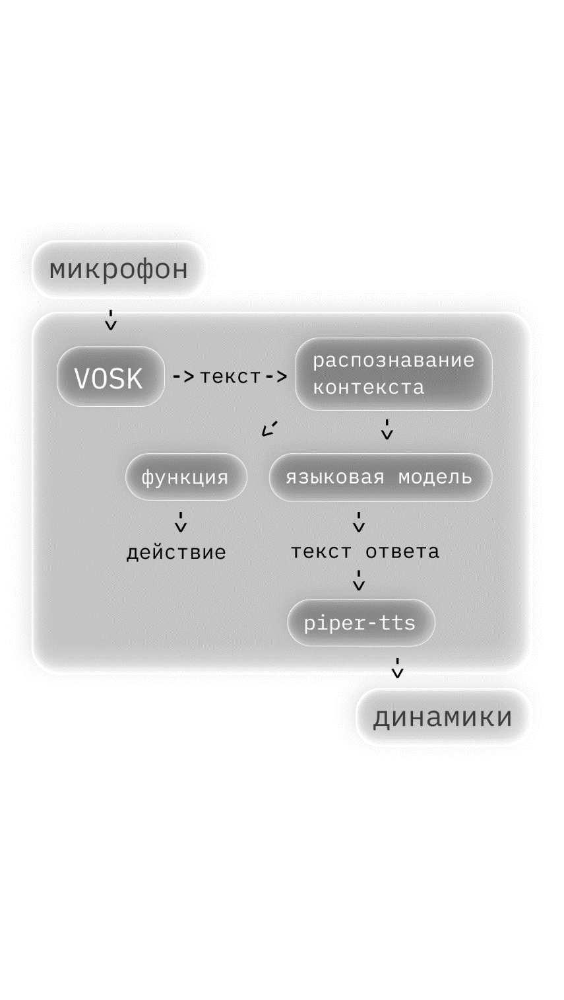

Рисунок
7 – Схема работы

Основной
алгоритм реализован на языке
программирования python,
выполняется на операционной системе
на основе GNU
Linux.
Python
был выбран, потому что для реализации
MVP
он наиболее подходящий: не нужно отдельно
компилировать код для ARM
архитектуры (универсальность), наличие
удобных готовых библиотек. В дальнейшем
возможно переведу проект на C++,
однако пока в этом необходимости нет,
ведь алгоритм просто связывает тяжелые
компоненты, координируя их работу и
управляет системой посредством голосовых
команд. GNU
Linux
– отличная платформа, которую можно
оптимизировать под любые нужды.

Голос
захватывается микрофоном, подается на
вход нейросети vosk,
которая преобразует голос в текст, в
тексте запроса ищется ключевая фраза,
если ее нет, то итерация продолжается
(устройство ждет ключевой фразы), если
есть, то текст запроса передается в
функцию распознавания контекста (на
начальном этапе это поиск по словарю),
далее текст передается в функцию, которая
формирует ответ в формате текста, либо
совершает какое-либо действие. Текст
ответа передается в функцию TTS,
которая синтезирует голос в звуковом
файле. Параллельно функция воспроизведения
воспроизводит готовые звуковые файлы
ответа. Так в алгоритме используются
тяжелые вычислительные алгоритмы
(нейросети), многопроцессорность, которая
позволяет максимизировать скорость
ответа для пользователя. Алгоритм, по
сути, бесконечный, так что анализировать
его сложность объективно нельзя
(бесконечно выполняется итерация). Я
оптимизировал все, что зависит от меня,
не использовал тяжелые функции, при
этом производительности одноплатного
микрокомпьютера на процессоре
энергоэффективной архитектуры ARM
более чем хватает.

<h2 class="western" style="line-height: 150%">
2.3.
Руководство пользователя</h2>

<b>Включение</b>

Подключите
устройство к электросети. После включения
устройство издаст сигнал готовности.
Подключите к устройству ethernet-кабель
или подключите клавиатуру и добавьте
вашу Wi-Fi
сеть. По желанию вы можете настроить
ключевое слово или добавить плагины,
или обновить систему. Устройство готово
к работе.

<b>Запрос</b>

Структура
запроса: ключевое слово, действие,
объект, доп. информация.

Пример:
Соня (ключевое слово), найди (действие)
в википедии (объект) Древняя Русь (доп.
информация).

<b>Технические
характеристики</b>

Таблица
3 – Технические характеристики

<table width="639" cellpadding="1" cellspacing="0">
	<col width="357"/>
	<col width="276"/>
	<tr valign="top">
		<td width="357" style="border: 1px solid #000000; padding-top: 1.06mm; padding-bottom: 0.79mm; padding-left: 0.09mm; padding-right: 13.14mm">

			Тип
			процессора

		</td>
		<td width="276" style="border: 1px solid #000000; padding-top: 1.06mm; padding-bottom: 0.79mm; padding-left: 0.09mm; padding-right: 3.97mm">

			bcm2711
			4-х ядерный cortex-a72

		</td>
	</tr>
	<tr valign="top">
		<td width="357" style="border: 1px solid #000000; padding-top: 1.06mm; padding-bottom: 0.79mm; padding-left: 0.09mm; padding-right: 13.14mm">

			Частота
			процессора

		</td>
		<td width="276" style="border: 1px solid #000000; padding-top: 1.06mm; padding-bottom: 0.79mm; padding-left: 0.09mm; padding-right: 3.97mm">

			1.5
			ггц

		</td>
	</tr>
	<tr valign="top">
		<td width="357" style="border: 1px solid #000000; padding-top: 1.06mm; padding-bottom: 0.79mm; padding-left: 0.09mm; padding-right: 13.14mm">

			Оперативная
			память

		</td>
		<td width="276" style="border: 1px solid #000000; padding-top: 1.06mm; padding-bottom: 0.79mm; padding-left: 0.09mm; padding-right: 3.97mm">

			4
			гб

		</td>
	</tr>
	<tr valign="top">
		<td width="357" style="border: 1px solid #000000; padding-top: 1.06mm; padding-bottom: 0.79mm; padding-left: 0.09mm; padding-right: 13.14mm">

			Графический
			процессор

		</td>
		<td width="276" style="border: 1px solid #000000; padding-top: 1.06mm; padding-bottom: 0.79mm; padding-left: 0.09mm; padding-right: 3.97mm">

			VideoCore
			VI

		</td>
	</tr>
	<tr valign="top">
		<td width="357" style="border: 1px solid #000000; padding-top: 1.06mm; padding-bottom: 0.79mm; padding-left: 0.09mm; padding-right: 13.14mm">

			Поддерживаемые
			операционные системы

		</td>
		<td width="276" style="border: 1px solid #000000; padding-top: 1.06mm; padding-bottom: 0.79mm; padding-left: 0.09mm; padding-right: 3.97mm">

			linux,
			windows 10 iot core

		</td>
	</tr>
	<tr valign="top">
		<td width="357" style="border: 1px solid #000000; padding-top: 1.06mm; padding-bottom: 0.79mm; padding-left: 0.09mm; padding-right: 13.14mm">

			Установленные
			интерфейсы

		</td>
		<td width="276" style="border: 1px solid #000000; padding-top: 1.06mm; padding-bottom: 0.79mm; padding-left: 0.09mm; padding-right: 3.97mm">

			m-sd,
			hdmi, ethernet, wi-fi, bt, usb, i/o

		</td>
	</tr>
	<tr valign="top">
		<td width="357" style="border: 1px solid #000000; padding-top: 1.06mm; padding-bottom: 0.79mm; padding-left: 0.09mm; padding-right: 13.14mm">

			Оперативная
			память

		</td>
		<td width="276" style="border: 1px solid #000000; padding-top: 1.06mm; padding-bottom: 0.79mm; padding-left: 0.09mm; padding-right: 3.97mm">

			4
			гб

		</td>
	</tr>
	<tr valign="top">
		<td width="357" style="border: 1px solid #000000; padding-top: 1.06mm; padding-bottom: 0.79mm; padding-left: 0.09mm; padding-right: 13.14mm">

			Вес,
			г

		</td>
		<td width="276" style="border: 1px solid #000000; padding-top: 1.06mm; padding-bottom: 0.79mm; padding-left: 0.09mm; padding-right: 3.97mm">

			25

		</td>
	</tr>
</table>
<h2 class="western" align="justify" style="line-height: 150%">
2.4.
Выбор материалов и компонентов</h2>

Таблица
4 – Выбор материалов

<table width="642" cellpadding="4" cellspacing="0">
	<col width="114"/>
	<col width="370"/>
	<col width="132"/>
	<tr valign="top">
		<td width="114" style="border-top: 1px solid #000000; border-bottom: 1px solid #000000; border-left: 1px solid #000000; border-right: none; padding-top: 0.97mm; padding-bottom: 0.97mm; padding-left: 0.97mm; padding-right: 0mm">

			Материал

		</td>
		<td width="370" style="border-top: 1px solid #000000; border-bottom: 1px solid #000000; border-left: 1px solid #000000; border-right: none; padding-top: 0.97mm; padding-bottom: 0.97mm; padding-left: 0.97mm; padding-right: 0mm">

			Описание

		</td>
		<td width="132" style="border: 1px solid #000000; padding: 0.97mm">

			Детали

		</td>
	</tr>
	<tr valign="top">
		<td width="114" style="border-top: none; border-bottom: 1px solid #000000; border-left: 1px solid #000000; border-right: none; padding-top: 0mm; padding-bottom: 0.97mm; padding-left: 0.97mm; padding-right: 0mm">

			PLA-пластик

		</td>
		<td width="370" style="border-top: none; border-bottom: 1px solid #000000; border-left: 1px solid #000000; border-right: none; padding-top: 0mm; padding-bottom: 0.97mm; padding-left: 0.97mm; padding-right: 0mm">

			Биоразлагаемый
			и биосовместимый материал, используемый
			в 3D-печати. Производится из кукурузы
			или сахарного тростника, обладает
			хорошей прочностью и стабильностью.

		</td>
		<td width="132" style="border-top: none; border-bottom: 1px solid #000000; border-left: 1px solid #000000; border-right: 1px solid #000000; padding-top: 0mm; padding-bottom: 0.97mm; padding-left: 0.97mm; padding-right: 0.97mm">

			Каркас
			устройства, корпус устройства, корпуса
			модулей.

		</td>
	</tr>
</table>

 
 

 
 

Таблица
4 – Выбор компонентов

<table width="642" cellpadding="4" cellspacing="0">
	<col width="250"/>
	<col width="120"/>
	<col width="246"/>
	<tr valign="top">
		<td width="250" style="border: 1px solid #000000; padding: 0.97mm">

			Компонент

		</td>
		<td width="120" style="border: 1px solid #000000; padding: 0.97mm">

			Количество

		</td>
		<td width="246" style="border: 1px solid #000000; padding: 0.97mm">

			Применение

		</td>
	</tr>
	<tr valign="top">
		<td width="250" style="border: 1px solid #000000; padding: 0.97mm">

			raspberry
			pi 4b.

		</td>
		<td width="120" style="border: 1px solid #000000; padding: 0.97mm">

			1

		</td>
		<td width="246" style="border: 1px solid #000000; padding: 0.97mm">

			“Мозг”
			проекта.

		</td>
	</tr>
	<tr valign="top">
		<td width="250" style="border: 1px solid #000000; padding: 0.97mm">

			аудио
			усилитель gf1002(pam8403).

		</td>
		<td width="120" style="border: 1px solid #000000; padding: 0.97mm">

			1

		</td>
		<td width="246" style="border: 1px solid #000000; padding: 0.97mm">

			Позволяет
			управлять динамиками.

		</td>
	</tr>
	<tr valign="top">
		<td width="250" style="border: 1px solid #000000; padding: 0.97mm">

			Динамики.

		</td>
		<td width="120" style="border: 1px solid #000000; padding: 0.97mm">

			1-2

		</td>
		<td width="246" style="border: 1px solid #000000; padding: 0.97mm">

			Воспроизводят
			звук.

		</td>
	</tr>
	<tr valign="top">
		<td width="250" style="border: 1px solid #000000; padding: 0.97mm">

			Микрофон.

		</td>
		<td width="120" style="border: 1px solid #000000; padding: 0.97mm">

			1-4

		</td>
		<td width="246" style="border: 1px solid #000000; padding: 0.97mm">

			Записывает
			звук.

		</td>
	</tr>
	<tr valign="top">
		<td width="250" style="border: 1px solid #000000; padding: 0.97mm">

			Камера
			ov5647.

		</td>
		<td width="120" style="border: 1px solid #000000; padding: 0.97mm">

			1

		</td>
		<td width="246" style="border: 1px solid #000000; padding: 0.97mm">

			Записывает
			видео.

		</td>
	</tr>
	<tr valign="top">
		<td width="250" style="border: 1px solid #000000; padding: 0.97mm">

			Проектор

		</td>
		<td width="120" style="border: 1px solid #000000; padding: 0.97mm">

			1

		</td>
		<td width="246" style="border: 1px solid #000000; padding: 0.97mm">

			Выводит
			изображение.

		</td>
	</tr>
</table>
<h2 class="western" align="justify" style="line-height: 150%">
2.5.
Технологическая карта</h2>

Таблица
5 – Технологическая карта

<table width="100%" cellpadding="4" cellspacing="0">
	<col width="50*"/>
	<col width="115*"/>
	<col width="27*"/>
	<col width="64*"/>
	<tr valign="top">
		<td width="19%" style="border-top: 1px solid #000000; border-bottom: 1px solid #000000; border-left: 1px solid #000000; border-right: none; padding-top: 0.97mm; padding-bottom: 0.97mm; padding-left: 0.97mm; padding-right: 0mm">

			НАИМЕНОВАНИЕ
			ОПЕРАЦИИ

		</td>
		<td width="45%" style="border-top: 1px solid #000000; border-bottom: 1px solid #000000; border-left: 1px solid #000000; border-right: none; padding-top: 0.97mm; padding-bottom: 0.97mm; padding-left: 0.97mm; padding-right: 0mm">

			ФОТО

		</td>
		<td width="10%" style="border-top: 1px solid #000000; border-bottom: 1px solid #000000; border-left: 1px solid #000000; border-right: none; padding-top: 0.97mm; padding-bottom: 0.97mm; padding-left: 0.97mm; padding-right: 0mm">

			МАТЕРИАЛЫ

		</td>
		<td width="25%" style="border: 1px solid #000000; padding: 0.97mm">

			ИСПОЛЬЗУЕМОЕ
			ОБОРУДОВАНИЕ

		</td>
	</tr>
	<tr valign="top">
		<td width="19%" style="border-top: none; border-bottom: 1px solid #000000; border-left: 1px solid #000000; border-right: none; padding-top: 0mm; padding-bottom: 0.97mm; padding-left: 0.97mm; padding-right: 0mm">

			Смоделировать
			3Д-модели по чертежам.

		</td>
		<td width="45%" style="border-top: none; border-bottom: 1px solid #000000; border-left: 1px solid #000000; border-right: none; padding-top: 0mm; padding-bottom: 0.97mm; padding-left: 0.97mm; padding-right: 0mm">

			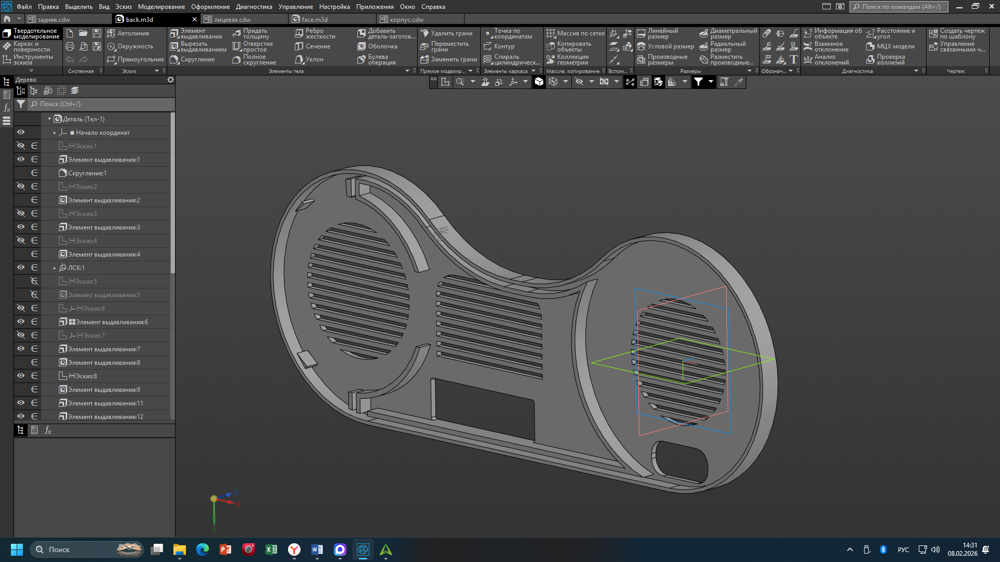

			
Рисунок
			8 – Моделирование

		</td>
		<td width="10%" style="border-top: none; border-bottom: 1px solid #000000; border-left: 1px solid #000000; border-right: none; padding-top: 0mm; padding-bottom: 0.97mm; padding-left: 0.97mm; padding-right: 0mm">

			-

		</td>
		<td width="25%" style="border-top: none; border-bottom: 1px solid #000000; border-left: 1px solid #000000; border-right: 1px solid #000000; padding-top: 0mm; padding-bottom: 0.97mm; padding-left: 0.97mm; padding-right: 0.97mm">

			Компас-3Д,
			Blender

		</td>
	</tr>
	<tr valign="top">
		<td width="19%" style="border-top: none; border-bottom: 1px solid #000000; border-left: 1px solid #000000; border-right: none; padding-top: 0mm; padding-bottom: 0.97mm; padding-left: 0.97mm; padding-right: 0mm">

			Подготовить
			3Д-модели к печати.

		</td>
		<td width="45%" style="border-top: none; border-bottom: 1px solid #000000; border-left: 1px solid #000000; border-right: none; padding-top: 0mm; padding-bottom: 0.97mm; padding-left: 0.97mm; padding-right: 0mm">

			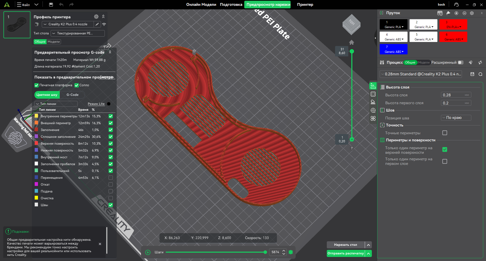

			
Рисунок
			9 – Подготовка к печати

		</td>
		<td width="10%" style="border-top: none; border-bottom: 1px solid #000000; border-left: 1px solid #000000; border-right: none; padding-top: 0mm; padding-bottom: 0.97mm; padding-left: 0.97mm; padding-right: 0mm">

			-

		</td>
		<td width="25%" style="border-top: none; border-bottom: 1px solid #000000; border-left: 1px solid #000000; border-right: 1px solid #000000; padding-top: 0mm; padding-bottom: 0.97mm; padding-left: 0.97mm; padding-right: 0.97mm">

			Creality
			Print

		</td>
	</tr>
	<tr valign="top">
		<td width="19%" style="border-top: none; border-bottom: 1px solid #000000; border-left: 1px solid #000000; border-right: none; padding-top: 0mm; padding-bottom: 0.97mm; padding-left: 0.97mm; padding-right: 0mm">

			Печать
			3Д-моделей.

		</td>
		<td width="45%" style="border-top: none; border-bottom: 1px solid #000000; border-left: 1px solid #000000; border-right: none; padding-top: 0mm; padding-bottom: 0.97mm; padding-left: 0.97mm; padding-right: 0mm">

			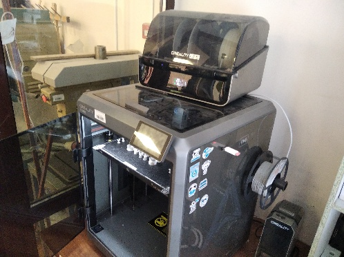

			
Рисунок
			10 – 3Д-печать

		</td>
		<td width="10%" style="border-top: none; border-bottom: 1px solid #000000; border-left: 1px solid #000000; border-right: none; padding-top: 0mm; padding-bottom: 0.97mm; padding-left: 0.97mm; padding-right: 0mm">

			PLA-пластик

		</td>
		<td width="25%" style="border-top: none; border-bottom: 1px solid #000000; border-left: 1px solid #000000; border-right: 1px solid #000000; padding-top: 0mm; padding-bottom: 0.97mm; padding-left: 0.97mm; padding-right: 0.97mm">

			3Д-принтер.

		</td>
	</tr>
	<tr valign="top">
		<td width="19%" style="border-top: none; border-bottom: 1px solid #000000; border-left: 1px solid #000000; border-right: none; padding-top: 0mm; padding-bottom: 0.97mm; padding-left: 0.97mm; padding-right: 0mm">

			Программирование
			микрокомпьютера

		</td>
		<td width="45%" style="border-top: none; border-bottom: 1px solid #000000; border-left: 1px solid #000000; border-right: none; padding-top: 0mm; padding-bottom: 0.97mm; padding-left: 0.97mm; padding-right: 0mm">

			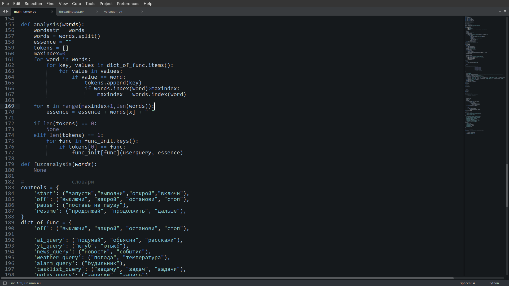

			
Рисунок
			11 – Программирование

		</td>
		<td width="10%" style="border-top: none; border-bottom: 1px solid #000000; border-left: 1px solid #000000; border-right: none; padding-top: 0mm; padding-bottom: 0.97mm; padding-left: 0.97mm; padding-right: 0mm">

			Микрокомпьютер

		</td>
		<td width="25%" style="border-top: none; border-bottom: 1px solid #000000; border-left: 1px solid #000000; border-right: 1px solid #000000; padding-top: 0mm; padding-bottom: 0.97mm; padding-left: 0.97mm; padding-right: 0.97mm">

			Компьютер

		</td>
	</tr>
	<tr valign="top">
		<td width="19%" style="border-top: none; border-bottom: 1px solid #000000; border-left: 1px solid #000000; border-right: none; padding-top: 0mm; padding-bottom: 0.97mm; padding-left: 0.97mm; padding-right: 0mm">

			Пайка
			компонентов.

		</td>
		<td width="45%" style="border-top: none; border-bottom: 1px solid #000000; border-left: 1px solid #000000; border-right: none; padding-top: 0mm; padding-bottom: 0.97mm; padding-left: 0.97mm; padding-right: 0mm">

			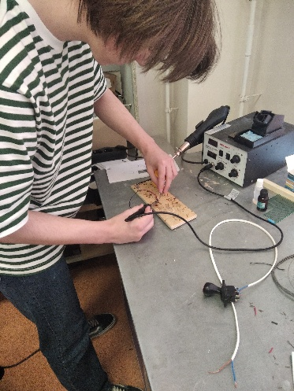

			
Рисунок
			12 – Пайка

		</td>
		<td width="10%" style="border-top: none; border-bottom: 1px solid #000000; border-left: 1px solid #000000; border-right: none; padding-top: 0mm; padding-bottom: 0.97mm; padding-left: 0.97mm; padding-right: 0mm">

			Припой

		</td>
		<td width="25%" style="border-top: none; border-bottom: 1px solid #000000; border-left: 1px solid #000000; border-right: 1px solid #000000; padding-top: 0mm; padding-bottom: 0.97mm; padding-left: 0.97mm; padding-right: 0.97mm">

			Паяльная
			станция, канцелярский нож, клеевой
			пистолет.

		</td>
	</tr>
	<tr valign="top">
		<td width="19%" style="border-top: none; border-bottom: 1px solid #000000; border-left: 1px solid #000000; border-right: none; padding-top: 0mm; padding-bottom: 0.97mm; padding-left: 0.97mm; padding-right: 0mm">

			Обработать
			3Д-модели.

		</td>
		<td width="45%" style="border-top: none; border-bottom: 1px solid #000000; border-left: 1px solid #000000; border-right: none; padding-top: 0mm; padding-bottom: 0.97mm; padding-left: 0.97mm; padding-right: 0mm">

			 

			

		</td>
		<td width="10%" style="border-top: none; border-bottom: 1px solid #000000; border-left: 1px solid #000000; border-right: none; padding-top: 0mm; padding-bottom: 0.97mm; padding-left: 0.97mm; padding-right: 0mm">

			-

		</td>
		<td width="25%" style="border-top: none; border-bottom: 1px solid #000000; border-left: 1px solid #000000; border-right: 1px solid #000000; padding-top: 0mm; padding-bottom: 0.97mm; padding-left: 0.97mm; padding-right: 0.97mm">

			Напильник,
			кусачки.

		</td>
	</tr>
	<tr valign="top">
		<td width="19%" style="border-top: none; border-bottom: 1px solid #000000; border-left: 1px solid #000000; border-right: none; padding-top: 0mm; padding-bottom: 0.97mm; padding-left: 0.97mm; padding-right: 0mm">

			Собрать
			устройство.

		</td>
		<td width="45%" style="border-top: none; border-bottom: 1px solid #000000; border-left: 1px solid #000000; border-right: none; padding-top: 0mm; padding-bottom: 0.97mm; padding-left: 0.97mm; padding-right: 0mm">

			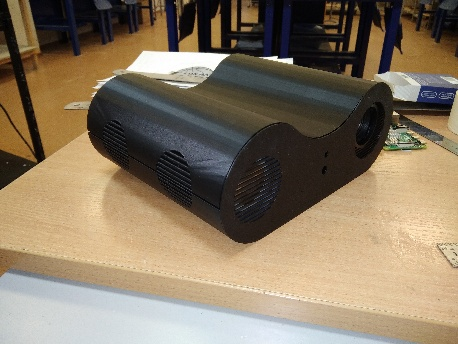

			
Рисунок
			13 – Сборка

		</td>
		<td width="10%" style="border-top: none; border-bottom: 1px solid #000000; border-left: 1px solid #000000; border-right: none; padding-top: 0mm; padding-bottom: 0.97mm; padding-left: 0.97mm; padding-right: 0mm">

			-

		</td>
		<td width="25%" style="border-top: none; border-bottom: 1px solid #000000; border-left: 1px solid #000000; border-right: 1px solid #000000; padding-top: 0mm; padding-bottom: 0.97mm; padding-left: 0.97mm; padding-right: 0.97mm">

			Клеевой
			пистолет

		</td>
	</tr>
	<tr valign="top">
		<td width="19%" style="border-top: none; border-bottom: 1px solid #000000; border-left: 1px solid #000000; border-right: none; padding-top: 0mm; padding-bottom: 0.97mm; padding-left: 0.97mm; padding-right: 0mm">

			Запуск
			и тестирование.

		</td>
		<td width="45%" style="border-top: none; border-bottom: 1px solid #000000; border-left: 1px solid #000000; border-right: none; padding-top: 0mm; padding-bottom: 0.97mm; padding-left: 0.97mm; padding-right: 0mm">

			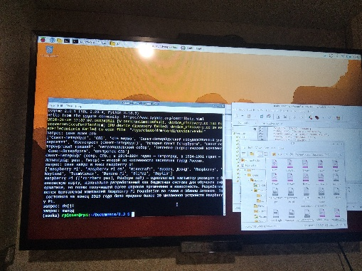

			
Рисунок
			14 – Тестирование

		</td>
		<td width="10%" style="border-top: none; border-bottom: 1px solid #000000; border-left: 1px solid #000000; border-right: none; padding-top: 0mm; padding-bottom: 0.97mm; padding-left: 0.97mm; padding-right: 0mm">

			-

		</td>
		<td width="25%" style="border-top: none; border-bottom: 1px solid #000000; border-left: 1px solid #000000; border-right: 1px solid #000000; padding-top: 0mm; padding-bottom: 0.97mm; padding-left: 0.97mm; padding-right: 0.97mm">

			-

		</td>
	</tr>
</table>

 
 

Чертежи
в приложении Б, техника безопасности
при изготовлении в приложении В

<h2 lang="ru-RU" class="western" align="justify" style="line-height: 150%">
 
 

</h2>
<h2 class="western" align="justify" style="margin-top: 0mm; line-height: 150%; page-break-before: always">
2.6.
Выбор оборудования и программного
обеспечения</h2>

Таблица
6 – Оборудование

<table width="100%" cellpadding="4" cellspacing="0">
	<col width="88*"/>
	<col width="168*"/>
	<tr valign="top">
		<td width="34%" style="border-top: 1px solid #000000; border-bottom: 1px solid #000000; border-left: 1px solid #000000; border-right: none; padding-top: 0.97mm; padding-bottom: 0.97mm; padding-left: 0.97mm; padding-right: 0mm">

			Инструмент

		</td>
		<td width="66%" style="border: 1px solid #000000; padding: 0.97mm">

			Использование

		</td>
	</tr>
	<tr valign="top">
		<td width="34%" style="border-top: none; border-bottom: 1px solid #000000; border-left: 1px solid #000000; border-right: none; padding-top: 0mm; padding-bottom: 0.97mm; padding-left: 0.97mm; padding-right: 0mm">

			3Д-принтер

		</td>
		<td width="66%" style="border-top: none; border-bottom: 1px solid #000000; border-left: 1px solid #000000; border-right: 1px solid #000000; padding-top: 0mm; padding-bottom: 0.97mm; padding-left: 0.97mm; padding-right: 0.97mm">

			Печать
			деталей.

		</td>
	</tr>
	<tr valign="top">
		<td width="34%" style="border-top: none; border-bottom: 1px solid #000000; border-left: 1px solid #000000; border-right: none; padding-top: 0mm; padding-bottom: 0.97mm; padding-left: 0.97mm; padding-right: 0mm">

			Паяльная
			станция

		</td>
		<td width="66%" style="border-top: none; border-bottom: 1px solid #000000; border-left: 1px solid #000000; border-right: 1px solid #000000; padding-top: 0mm; padding-bottom: 0.97mm; padding-left: 0.97mm; padding-right: 0.97mm">

			Пайка
			проводов.

		</td>
	</tr>
	<tr valign="top">
		<td width="34%" style="border-top: none; border-bottom: 1px solid #000000; border-left: 1px solid #000000; border-right: none; padding-top: 0mm; padding-bottom: 0.97mm; padding-left: 0.97mm; padding-right: 0mm">

			Напильник
			плоский

		</td>
		<td width="66%" style="border-top: none; border-bottom: 1px solid #000000; border-left: 1px solid #000000; border-right: 1px solid #000000; padding-top: 0mm; padding-bottom: 0.97mm; padding-left: 0.97mm; padding-right: 0.97mm">

			Обтачивание
			деталей.

		</td>
	</tr>
	<tr valign="top">
		<td width="34%" style="border-top: none; border-bottom: 1px solid #000000; border-left: 1px solid #000000; border-right: none; padding-top: 0mm; padding-bottom: 0.97mm; padding-left: 0.97mm; padding-right: 0mm">

			Нож
			канцелярский

		</td>
		<td width="66%" style="border-top: none; border-bottom: 1px solid #000000; border-left: 1px solid #000000; border-right: 1px solid #000000; padding-top: 0mm; padding-bottom: 0.97mm; padding-left: 0.97mm; padding-right: 0.97mm">

			Зачистка
			проводов, резка.

		</td>
	</tr>
	<tr valign="top">
		<td width="34%" style="border-top: none; border-bottom: 1px solid #000000; border-left: 1px solid #000000; border-right: none; padding-top: 0mm; padding-bottom: 0.97mm; padding-left: 0.97mm; padding-right: 0mm">

			Клеевой
			пистолет

		</td>
		<td width="66%" style="border-top: none; border-bottom: 1px solid #000000; border-left: 1px solid #000000; border-right: 1px solid #000000; padding-top: 0mm; padding-bottom: 0.97mm; padding-left: 0.97mm; padding-right: 0.97mm">

			Соединение
			деталей, изоляция проводов.

		</td>
	</tr>
	<tr valign="top">
		<td width="34%" style="border-top: none; border-bottom: 1px solid #000000; border-left: 1px solid #000000; border-right: none; padding-top: 0mm; padding-bottom: 0.97mm; padding-left: 0.97mm; padding-right: 0mm">

			Кусачки

		</td>
		<td width="66%" style="border-top: none; border-bottom: 1px solid #000000; border-left: 1px solid #000000; border-right: 1px solid #000000; padding-top: 0mm; padding-bottom: 0.97mm; padding-left: 0.97mm; padding-right: 0.97mm">

			Откусывание
			поддержек.

		</td>
	</tr>
	<tr valign="top">
		<td width="34%" style="border-top: none; border-bottom: 1px solid #000000; border-left: 1px solid #000000; border-right: none; padding-top: 0mm; padding-bottom: 0.97mm; padding-left: 0.97mm; padding-right: 0mm">

			Компьютер

		</td>
		<td width="66%" style="border-top: none; border-bottom: 1px solid #000000; border-left: 1px solid #000000; border-right: 1px solid #000000; padding-top: 0mm; padding-bottom: 0.97mm; padding-left: 0.97mm; padding-right: 0.97mm">

			Подготовка
			3Д-моделей

		</td>
	</tr>
	<tr valign="top">
		<td width="34%" style="border-top: none; border-bottom: 1px solid #000000; border-left: 1px solid #000000; border-right: none; padding-top: 0mm; padding-bottom: 0.97mm; padding-left: 0.97mm; padding-right: 0mm">

			Отвертка

		</td>
		<td width="66%" style="border-top: none; border-bottom: 1px solid #000000; border-left: 1px solid #000000; border-right: 1px solid #000000; padding-top: 0mm; padding-bottom: 0.97mm; padding-left: 0.97mm; padding-right: 0.97mm">

			Кручение
			винтов.

		</td>
	</tr>
</table>

<b>Программное
обеспечение</b>

Таблица
7 - Программное обеспечение

<table width="100%" cellpadding="4" cellspacing="0">
	<col width="88*"/>
	<col width="168*"/>
	<tr valign="top">
		<td width="34%" style="border-top: 1px solid #000000; border-bottom: 1px solid #000000; border-left: 1px solid #000000; border-right: none; padding-top: 0.97mm; padding-bottom: 0.97mm; padding-left: 0.97mm; padding-right: 0mm">

			Программное
			обеспечение

		</td>
		<td width="66%" style="border: 1px solid #000000; padding: 0.97mm">

			Использование

		</td>
	</tr>
	<tr valign="top">
		<td width="34%" style="border-top: none; border-bottom: 1px solid #000000; border-left: 1px solid #000000; border-right: none; padding-top: 0mm; padding-bottom: 0.97mm; padding-left: 0.97mm; padding-right: 0mm">

			Компас-3Д

		</td>
		<td width="66%" style="border-top: none; border-bottom: 1px solid #000000; border-left: 1px solid #000000; border-right: 1px solid #000000; padding-top: 0mm; padding-bottom: 0.97mm; padding-left: 0.97mm; padding-right: 0.97mm">

			Отрисовка
			чертежей, моделирование деталей.

		</td>
	</tr>
	<tr valign="top">
		<td width="34%" style="border-top: none; border-bottom: 1px solid #000000; border-left: 1px solid #000000; border-right: none; padding-top: 0mm; padding-bottom: 0.97mm; padding-left: 0.97mm; padding-right: 0mm">

			Blender

		</td>
		<td width="66%" style="border-top: none; border-bottom: 1px solid #000000; border-left: 1px solid #000000; border-right: 1px solid #000000; padding-top: 0mm; padding-bottom: 0.97mm; padding-left: 0.97mm; padding-right: 0.97mm">

			Правка
			3Д-моделей.

		</td>
	</tr>
	<tr valign="top">
		<td width="34%" style="border-top: none; border-bottom: 1px solid #000000; border-left: 1px solid #000000; border-right: none; padding-top: 0mm; padding-bottom: 0.97mm; padding-left: 0.97mm; padding-right: 0mm">

			Creality
			Print

		</td>
		<td width="66%" style="border-top: none; border-bottom: 1px solid #000000; border-left: 1px solid #000000; border-right: 1px solid #000000; padding-top: 0mm; padding-bottom: 0.97mm; padding-left: 0.97mm; padding-right: 0.97mm">

			Подготовка
			моделей к печати на 3Д-принтере.

		</td>
	</tr>
	<tr valign="top">
		<td width="34%" style="border-top: none; border-bottom: 1px solid #000000; border-left: 1px solid #000000; border-right: none; padding-top: 0mm; padding-bottom: 0.97mm; padding-left: 0.97mm; padding-right: 0mm">

			dd

		</td>
		<td width="66%" style="border-top: none; border-bottom: 1px solid #000000; border-left: 1px solid #000000; border-right: 1px solid #000000; padding-top: 0mm; padding-bottom: 0.97mm; padding-left: 0.97mm; padding-right: 0.97mm">

			Запись
			системы на SD-карту

		</td>
	</tr>
	<tr valign="top">
		<td width="34%" style="border-top: none; border-bottom: 1px solid #000000; border-left: 1px solid #000000; border-right: none; padding-top: 0mm; padding-bottom: 0.97mm; padding-left: 0.97mm; padding-right: 0mm">

			NeoVim

		</td>
		<td width="66%" style="border-top: none; border-bottom: 1px solid #000000; border-left: 1px solid #000000; border-right: 1px solid #000000; padding-top: 0mm; padding-bottom: 0.97mm; padding-left: 0.97mm; padding-right: 0.97mm">

			Редактирование
			кода и системных файлов.

		</td>
	</tr>
	<tr valign="top">
		<td width="34%" style="border-top: none; border-bottom: 1px solid #000000; border-left: 1px solid #000000; border-right: none; padding-top: 0mm; padding-bottom: 0.97mm; padding-left: 0.97mm; padding-right: 0mm">

			Sublime
			Text

		</td>
		<td width="66%" style="border-top: none; border-bottom: 1px solid #000000; border-left: 1px solid #000000; border-right: 1px solid #000000; padding-top: 0mm; padding-bottom: 0.97mm; padding-left: 0.97mm; padding-right: 0.97mm">

			Редактирование
			файлов.

		</td>
	</tr>
	<tr valign="top">
		<td width="34%" style="border-top: none; border-bottom: 1px solid #000000; border-left: 1px solid #000000; border-right: none; padding-top: 0mm; padding-bottom: 0.97mm; padding-left: 0.97mm; padding-right: 0mm">

			Obsidian

		</td>
		<td width="66%" style="border-top: none; border-bottom: 1px solid #000000; border-left: 1px solid #000000; border-right: 1px solid #000000; padding-top: 0mm; padding-bottom: 0.97mm; padding-left: 0.97mm; padding-right: 0.97mm">

			Ведение
			заметок и конспектов.

		</td>
	</tr>
</table>

 
 

 
 

<h1 lang="ru-RU" class="western" align="justify" style="margin-top: 0mm; line-height: 150%">
 
 

</h1>
<h1 class="western" align="justify" style="margin-top: 0mm; line-height: 150%; page-break-before: always">
ГЛАВА
III
– «ЭКОЛОГО-ЭКОНОМИЧЕСКОЕ ОБОСНОВАНИЕ»</h1>
<h2 class="western" align="justify" style="line-height: 150%">
3.1.
Экологическое обоснование</h2>

<em>Разработка
и эксплуатация осуществляются с учётом
принципов экологической ответственности
и устойчивого развития. Проект оказывает
минимальное негативное воздействие на
окружающую среду, а в долгосрочной
перспективе способствует формированию
экологического сознания будущих
инженеров</em><em>.</em>

<b>Этап
проектирования и разработки:</b>

Воздействие:
отсутствует. Основные процессы —
компьютерное моделирование и разработка
документации — не требуют расхода
материалов и не создают отходов.

Экологический
плюс:&nbsp;Тщательная
цифровая оптимизация деталей перед
печатью минимизирует риск брака и
перерасхода материалов на последующих
этапах.

<b>Этап
изготовления (производства):</b>

Используемые
материалы:&nbsp;Основной
материал для деталей – термопластик
PLA
(полилактид) для 3D-печати.

Преимущество
PLA:
это биоразлагаемый пластик, производимый
из возобновляемого сырья (кукурузный
крахмал, сахарный тростник). Его
производство и утилизация наносят
меньший вред экосистеме по сравнению
с традиционными нефтехимическими
пластиками (ABS,
PETG).

Электронные
компоненты: используются стандартные
широко распространённые модули, которые
могут быть повторно использованы в
других проектах.

Энергопотребление:&nbsp;Процесс
3D-печати
энергозатратен, однако изготовление
одной умной колонки требует относительно
небольшого количества электроэнергии
(меньше двадцати часов печати).

<b>Этап
эксплуатации:</b>

Энергоэффективность:&nbsp;устройство
управляется энергоэффективным процессором
на архитектуре ARM.

Отсутствие
вредных выбросов:&nbsp;в
процессе работы устройство не производит
выбросов.

Уровень
шума:&nbsp;уровень
шума низкий засчет использования
пассивного охлаждения, на высоких
нагрузках могут включаться вентиляторы,
которых из закрытого корпуса не слышно.

<h2 class="western" align="justify" style="line-height: 150%">
3.2.
Экономическое обоснование</h2>

 
 

 
 

 
 

 
 

Таблица
8 – Экономическое обоснование

<table width="98%" cellpadding="4" cellspacing="0">
	<col width="77*"/>
	<col width="134*"/>
	<col width="45*"/>
	<tr valign="top">
		<td width="30%" height="24" style="border-top: 1px solid #000000; border-bottom: 1px solid #000000; border-left: 1px solid #000000; border-right: none; padding-top: 0.97mm; padding-bottom: 0.97mm; padding-left: 0.97mm; padding-right: 0mm">

			Компонент

		</td>
		<td width="52%" style="border-top: 1px solid #000000; border-bottom: 1px solid #000000; border-left: 1px solid #000000; border-right: none; padding-top: 0.97mm; padding-bottom: 0.97mm; padding-left: 0.97mm; padding-right: 0mm">

			Фото

		</td>
		<td width="17%" style="border: 1px solid #000000; padding: 0.97mm">

			Цена,
			руб

		</td>
	</tr>
	<tr valign="top">
		<td width="30%" height="25" style="border-top: none; border-bottom: 1px solid #000000; border-left: 1px solid #000000; border-right: none; padding-top: 0mm; padding-bottom: 0.97mm; padding-left: 0.97mm; padding-right: 0mm">

			Raspberry
			pi 4b.

		</td>
		<td width="52%" style="border-top: none; border-bottom: 1px solid #000000; border-left: 1px solid #000000; border-right: none; padding-top: 0mm; padding-bottom: 0.97mm; padding-left: 0.97mm; padding-right: 0mm">

			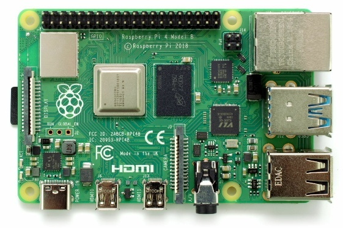

			
Рисунок
			15 – Raspberry
			Pi

		</td>
		<td width="17%" style="border-top: none; border-bottom: 1px solid #000000; border-left: 1px solid #000000; border-right: 1px solid #000000; padding-top: 0mm; padding-bottom: 0.97mm; padding-left: 0.97mm; padding-right: 0.97mm">

			6120

		</td>
	</tr>
	<tr valign="top">
		<td width="30%" height="26" style="border-top: none; border-bottom: 1px solid #000000; border-left: 1px solid #000000; border-right: none; padding-top: 0mm; padding-bottom: 0.97mm; padding-left: 0.97mm; padding-right: 0mm">

			Аудио
			усилитель gf1002(pam8403).

		</td>
		<td width="52%" style="border-top: none; border-bottom: 1px solid #000000; border-left: 1px solid #000000; border-right: none; padding-top: 0mm; padding-bottom: 0.97mm; padding-left: 0.97mm; padding-right: 0mm">

			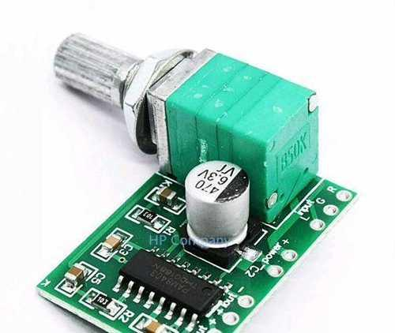

			
Рисунок
			16 – Аудио усилитель

		</td>
		<td width="17%" style="border-top: none; border-bottom: 1px solid #000000; border-left: 1px solid #000000; border-right: 1px solid #000000; padding-top: 0mm; padding-bottom: 0.97mm; padding-left: 0.97mm; padding-right: 0.97mm">

			80

		</td>
	</tr>
	<tr valign="top">
		<td width="30%" height="25" style="border-top: none; border-bottom: 1px solid #000000; border-left: 1px solid #000000; border-right: none; padding-top: 0mm; padding-bottom: 0.97mm; padding-left: 0.97mm; padding-right: 0mm">

			Динамики.

		</td>
		<td width="52%" style="border-top: none; border-bottom: 1px solid #000000; border-left: 1px solid #000000; border-right: none; padding-top: 0mm; padding-bottom: 0.97mm; padding-left: 0.97mm; padding-right: 0mm">

			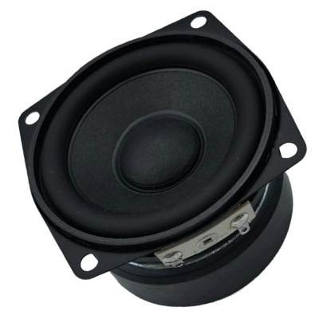

			
Рисунок
			17 – Динамик

		</td>
		<td width="17%" style="border-top: none; border-bottom: 1px solid #000000; border-left: 1px solid #000000; border-right: 1px solid #000000; padding-top: 0mm; padding-bottom: 0.97mm; padding-left: 0.97mm; padding-right: 0.97mm">

			420

		</td>
	</tr>
	<tr valign="top">
		<td width="30%" height="25" style="border-top: none; border-bottom: 1px solid #000000; border-left: 1px solid #000000; border-right: none; padding-top: 0mm; padding-bottom: 0.97mm; padding-left: 0.97mm; padding-right: 0mm">

			Микрофон.

		</td>
		<td width="52%" style="border-top: none; border-bottom: 1px solid #000000; border-left: 1px solid #000000; border-right: none; padding-top: 0mm; padding-bottom: 0.97mm; padding-left: 0.97mm; padding-right: 0mm">

			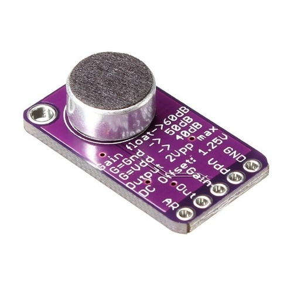

			
Рисунок
			18 – Микрофон

		</td>
		<td width="17%" style="border-top: none; border-bottom: 1px solid #000000; border-left: 1px solid #000000; border-right: 1px solid #000000; padding-top: 0mm; padding-bottom: 0.97mm; padding-left: 0.97mm; padding-right: 0.97mm">

			290

		</td>
	</tr>
	<tr valign="top">
		<td width="30%" height="26" style="border-top: none; border-bottom: 1px solid #000000; border-left: 1px solid #000000; border-right: none; padding-top: 0mm; padding-bottom: 0.97mm; padding-left: 0.97mm; padding-right: 0mm">

			Камера
			ov5647.

		</td>
		<td width="52%" style="border-top: none; border-bottom: 1px solid #000000; border-left: 1px solid #000000; border-right: none; padding-top: 0mm; padding-bottom: 0.97mm; padding-left: 0.97mm; padding-right: 0mm">

			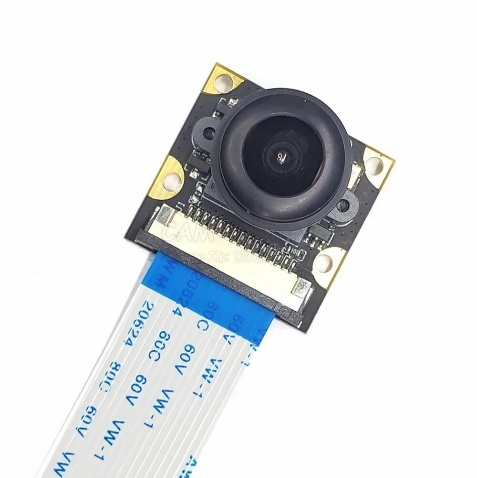

			
Рисунок
			19 – Камера

		</td>
		<td width="17%" style="border-top: none; border-bottom: 1px solid #000000; border-left: 1px solid #000000; border-right: 1px solid #000000; padding-top: 0mm; padding-bottom: 0.97mm; padding-left: 0.97mm; padding-right: 0.97mm">

			540

		</td>
	</tr>
	<tr valign="top">
		<td width="30%" height="25" style="border-top: none; border-bottom: 1px solid #000000; border-left: 1px solid #000000; border-right: none; padding-top: 0mm; padding-bottom: 0.97mm; padding-left: 0.97mm; padding-right: 0mm">

			PLA-пластик

		</td>
		<td width="52%" style="border-top: none; border-bottom: 1px solid #000000; border-left: 1px solid #000000; border-right: none; padding-top: 0mm; padding-bottom: 0.97mm; padding-left: 0.97mm; padding-right: 0mm">

			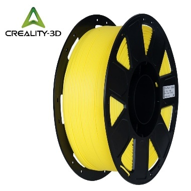

			
Рисунок
			20 – Катушка пластика

		</td>
		<td width="17%" style="border-top: none; border-bottom: 1px solid #000000; border-left: 1px solid #000000; border-right: 1px solid #000000; padding-top: 0mm; padding-bottom: 0.97mm; padding-left: 0.97mm; padding-right: 0.97mm">

			310

		</td>
	</tr>
	<tr valign="top">
		<td width="30%" height="25" style="border-top: none; border-bottom: 1px solid #000000; border-left: 1px solid #000000; border-right: none; padding-top: 0mm; padding-bottom: 0.97mm; padding-left: 0.97mm; padding-right: 0mm">

			Проектор

		</td>
		<td width="52%" style="border-top: none; border-bottom: 1px solid #000000; border-left: 1px solid #000000; border-right: none; padding-top: 0mm; padding-bottom: 0.97mm; padding-left: 0.97mm; padding-right: 0mm">

			 

			

		</td>
		<td width="17%" style="border-top: none; border-bottom: 1px solid #000000; border-left: 1px solid #000000; border-right: 1px solid #000000; padding-top: 0mm; padding-bottom: 0.97mm; padding-left: 0.97mm; padding-right: 0.97mm">

			2400

		</td>
	</tr>
	<tr valign="top">
		<td width="30%" height="24" style="border-top: none; border-bottom: 1px solid #000000; border-left: 1px solid #000000; border-right: none; padding-top: 0mm; padding-bottom: 0.97mm; padding-left: 0.97mm; padding-right: 0mm">

			ИТОГО:

		</td>
		<td width="52%" style="border-top: none; border-bottom: 1px solid #000000; border-left: 1px solid #000000; border-right: none; padding-top: 0mm; padding-bottom: 0.97mm; padding-left: 0.97mm; padding-right: 0mm">

			 

			

		</td>
		<td width="17%" style="border-top: none; border-bottom: 1px solid #000000; border-left: 1px solid #000000; border-right: 1px solid #000000; padding-top: 0mm; padding-bottom: 0.97mm; padding-left: 0.97mm; padding-right: 0.97mm">

			10160

		</td>
	</tr>
</table>

<b>Сравнение
с аналогами</b>

Для
сравнения моего устройства с аналогами
необходимо понять, по каким критериям
потребитель выбирает продукт, то есть
умную колонку. Поэтому я решил провести
опрос среди моих знакомых. В опросе
участвовали очень разные люди: от
художников до электриков, от детей до
пенсионеров. Опрос проходил анонимно
и дистанционно. Участнику опроса
необходимо было написать несколько
критериев, по которым он выбирал бы
умную колонку. После получения результатов
опроса, я обобщил некоторые узконаправленные
критерии в более общие.

	Критерии
сравнения: цена (стоимость устройства
+ стоимость подписки), функциональность
(количество функций), качество (качество
сборки, качество звука), приватность
(степень обеспечения анонимности и
приватности). Оценка проводится по
пятибальной системе (2 – плохо, 3 –
удовлетворительно, 4 – хорошо, 5 –
отлично).

Таблица
9 – Сравнение моего устройства с аналогами

<table width="683" cellpadding="4" cellspacing="0">
	<col width="77"/>
	<col width="107"/>
	<col width="137"/>
	<col width="135"/>
	<col width="136"/>
	<col width="41"/>
	<tr valign="top">
		<td width="77" style="border-top: 1px solid #000000; border-bottom: 1px solid #000000; border-left: 1px solid #000000; border-right: none; padding-top: 0.97mm; padding-bottom: 0.97mm; padding-left: 0.97mm; padding-right: 0mm">

			Модель

		</td>
		<td width="107" style="border-top: 1px solid #000000; border-bottom: 1px solid #000000; border-left: 1px solid #000000; border-right: none; padding-top: 0.97mm; padding-bottom: 0.97mm; padding-left: 0.97mm; padding-right: 0mm">

			Цена,
			руб

		</td>
		<td width="137" style="border-top: 1px solid #000000; border-bottom: 1px solid #000000; border-left: 1px solid #000000; border-right: none; padding-top: 0.97mm; padding-bottom: 0.97mm; padding-left: 0.97mm; padding-right: 0mm">

			Функциональность

		</td>
		<td width="135" style="border-top: 1px solid #000000; border-bottom: 1px solid #000000; border-left: 1px solid #000000; border-right: none; padding-top: 0.97mm; padding-bottom: 0.97mm; padding-left: 0.97mm; padding-right: 0mm">

			Качество

		</td>
		<td width="136" style="border-top: 1px solid #000000; border-bottom: 1px solid #000000; border-left: 1px solid #000000; border-right: none; padding-top: 0.97mm; padding-bottom: 0.97mm; padding-left: 0.97mm; padding-right: 0mm">

			Приватность

		</td>
		<td width="41" style="border: 1px solid #000000; padding: 0.97mm">

			Итого:

		</td>
	</tr>
	<tr valign="top">
		<td width="77" style="border-top: none; border-bottom: 1px solid #000000; border-left: 1px solid #000000; border-right: none; padding-top: 0mm; padding-bottom: 0.97mm; padding-left: 0.97mm; padding-right: 0mm">

			Amazon
			Echo

		</td>
		<td width="107" style="border-top: none; border-bottom: 1px solid #000000; border-left: 1px solid #000000; border-right: none; padding-top: 0mm; padding-bottom: 0.97mm; padding-left: 0.97mm; padding-right: 0mm">

			6200
			руб. за устройство + 20$ (1&nbsp;540 руб.) в
			месяц подписка (3 балла)

		</td>
		<td width="137" style="border-top: none; border-bottom: 1px solid #000000; border-left: 1px solid #000000; border-right: none; padding-top: 0mm; padding-bottom: 0.97mm; padding-left: 0.97mm; padding-right: 0mm">

			Количество
			функций велико, можно создавать свои.
			(4
			балла)

		</td>
		<td width="135" style="border-top: none; border-bottom: 1px solid #000000; border-left: 1px solid #000000; border-right: none; padding-top: 0mm; padding-bottom: 0.97mm; padding-left: 0.97mm; padding-right: 0mm">

			Используется
			хорошая аудиосистема. (4 балла)

		</td>
		<td width="136" style="border-top: none; border-bottom: 1px solid #000000; border-left: 1px solid #000000; border-right: none; padding-top: 0mm; padding-bottom: 0.97mm; padding-left: 0.97mm; padding-right: 0mm">

			Все
			данные хранятся и обрабатываются на
			серверах и сотрудниками, происходили
			утечки. (2
			балла)

		</td>
		<td width="41" style="border-top: none; border-bottom: 1px solid #000000; border-left: 1px solid #000000; border-right: 1px solid #000000; padding-top: 0mm; padding-bottom: 0.97mm; padding-left: 0.97mm; padding-right: 0.97mm">

			13

		</td>
	</tr>
	<tr valign="top">
		<td width="77" style="border-top: none; border-bottom: 1px solid #000000; border-left: 1px solid #000000; border-right: none; padding-top: 0mm; padding-bottom: 0.97mm; padding-left: 0.97mm; padding-right: 0mm">

			Google
			Nest

		</td>
		<td width="107" style="border-top: none; border-bottom: 1px solid #000000; border-left: 1px solid #000000; border-right: none; padding-top: 0mm; padding-bottom: 0.97mm; padding-left: 0.97mm; padding-right: 0mm">

			22800
			руб.
			(3
			балла)

		</td>
		<td width="137" style="border-top: none; border-bottom: 1px solid #000000; border-left: 1px solid #000000; border-right: none; padding-top: 0mm; padding-bottom: 0.97mm; padding-left: 0.97mm; padding-right: 0mm">

			Количество
			функций обширное, тесная интеграция
			с сервисами Google.
			(4
			балла)

		</td>
		<td width="135" style="border-top: none; border-bottom: 1px solid #000000; border-left: 1px solid #000000; border-right: none; padding-top: 0mm; padding-bottom: 0.97mm; padding-left: 0.97mm; padding-right: 0mm">

			Используется
			среднего качества аудиосистема,
			нормальная сборка. (4
			балла)

		</td>
		<td width="136" style="border-top: none; border-bottom: 1px solid #000000; border-left: 1px solid #000000; border-right: none; padding-top: 0mm; padding-bottom: 0.97mm; padding-left: 0.97mm; padding-right: 0mm">

			Данные
			хранятся и обрабатываются на серверах(3
			балла)

		</td>
		<td width="41" style="border-top: none; border-bottom: 1px solid #000000; border-left: 1px solid #000000; border-right: 1px solid #000000; padding-top: 0mm; padding-bottom: 0.97mm; padding-left: 0.97mm; padding-right: 0.97mm">

			14

		</td>
	</tr>
	<tr valign="top">
		<td width="77" style="border-top: none; border-bottom: 1px solid #000000; border-left: 1px solid #000000; border-right: none; padding-top: 0mm; padding-bottom: 0.97mm; padding-left: 0.97mm; padding-right: 0mm">

			Apple
			HomePod

		</td>
		<td width="107" style="border-top: none; border-bottom: 1px solid #000000; border-left: 1px solid #000000; border-right: none; padding-top: 0mm; padding-bottom: 0.97mm; padding-left: 0.97mm; padding-right: 0mm">

			42902
			руб.
			(2 балла)

		</td>
		<td width="137" style="border-top: none; border-bottom: 1px solid #000000; border-left: 1px solid #000000; border-right: none; padding-top: 0mm; padding-bottom: 0.97mm; padding-left: 0.97mm; padding-right: 0mm">

			Количество
			функций мало. Siri
			практически бесполезный ассистент.
			(3
			балла)

		</td>
		<td width="135" style="border-top: none; border-bottom: 1px solid #000000; border-left: 1px solid #000000; border-right: none; padding-top: 0mm; padding-bottom: 0.97mm; padding-left: 0.97mm; padding-right: 0mm">

			Используется
			отличная аудиосистема, хорошая сборка.
			(5
			баллов)

		</td>
		<td width="136" style="border-top: none; border-bottom: 1px solid #000000; border-left: 1px solid #000000; border-right: none; padding-top: 0mm; padding-bottom: 0.97mm; padding-left: 0.97mm; padding-right: 0mm">

			Со
			стороны Apple
			утечек было мало, однако крупная утечка
			iCloud
			потрясла мир. (4
			балла)

		</td>
		<td width="41" style="border-top: none; border-bottom: 1px solid #000000; border-left: 1px solid #000000; border-right: 1px solid #000000; padding-top: 0mm; padding-bottom: 0.97mm; padding-left: 0.97mm; padding-right: 0.97mm">

			14

		</td>
	</tr>
	<tr valign="top">
		<td width="77" style="border-top: none; border-bottom: 1px solid #000000; border-left: 1px solid #000000; border-right: none; padding-top: 0mm; padding-bottom: 0.97mm; padding-left: 0.97mm; padding-right: 0mm">

			Yandex
			Station

		</td>
		<td width="107" style="border-top: none; border-bottom: 1px solid #000000; border-left: 1px solid #000000; border-right: none; padding-top: 0mm; padding-bottom: 0.97mm; padding-left: 0.97mm; padding-right: 0mm">

			22918
			руб. за устройство + 500 руб. в месяц за
			подписку (3 балла)

		</td>
		<td width="137" style="border-top: none; border-bottom: 1px solid #000000; border-left: 1px solid #000000; border-right: none; padding-top: 0mm; padding-bottom: 0.97mm; padding-left: 0.97mm; padding-right: 0mm">

			Функций
			много, можно создавать собственные,
			тесная интеграия с сервисами Яндекса.
			(4
			балла)

		</td>
		<td width="135" style="border-top: none; border-bottom: 1px solid #000000; border-left: 1px solid #000000; border-right: none; padding-top: 0mm; padding-bottom: 0.97mm; padding-left: 0.97mm; padding-right: 0mm">

			В
			версии Макс используется хорошая
			аудиосистема, сборка качественная.
			(3
			балла)

		</td>
		<td width="136" style="border-top: none; border-bottom: 1px solid #000000; border-left: 1px solid #000000; border-right: none; padding-top: 0mm; padding-bottom: 0.97mm; padding-left: 0.97mm; padding-right: 0mm">

			Яндекс
			хранит историю запросов у себя на
			серверах. Утечки
			были. (3 балла)

		</td>
		<td width="41" style="border-top: none; border-bottom: 1px solid #000000; border-left: 1px solid #000000; border-right: 1px solid #000000; padding-top: 0mm; padding-bottom: 0.97mm; padding-left: 0.97mm; padding-right: 0.97mm">

			13

		</td>
	</tr>
	<tr valign="top">
		<td width="77" style="border-top: none; border-bottom: 1px solid #000000; border-left: 1px solid #000000; border-right: none; padding-top: 0mm; padding-bottom: 0.97mm; padding-left: 0.97mm; padding-right: 0mm">

			VK
			Station

		</td>
		<td width="107" style="border-top: none; border-bottom: 1px solid #000000; border-left: 1px solid #000000; border-right: none; padding-top: 0mm; padding-bottom: 0.97mm; padding-left: 0.97mm; padding-right: 0mm">

			14708
			руб. за устройство + 200 руб. в месяц (4
			балла)

		</td>
		<td width="137" style="border-top: none; border-bottom: 1px solid #000000; border-left: 1px solid #000000; border-right: none; padding-top: 0mm; padding-bottom: 0.97mm; padding-left: 0.97mm; padding-right: 0mm">

			Очень
			мало функций, но есть интеграция с
			сервисами ВК. (2
			балла)

		</td>
		<td width="135" style="border-top: none; border-bottom: 1px solid #000000; border-left: 1px solid #000000; border-right: none; padding-top: 0mm; padding-bottom: 0.97mm; padding-left: 0.97mm; padding-right: 0mm">

			Используется
			дешевая аудиосистема, слабый
			микрокомпьютер. (3 балла)

		</td>
		<td width="136" style="border-top: none; border-bottom: 1px solid #000000; border-left: 1px solid #000000; border-right: none; padding-top: 0mm; padding-bottom: 0.97mm; padding-left: 0.97mm; padding-right: 0mm">

			Случались
			крупные утечки (2
			балла)

		</td>
		<td width="41" style="border-top: none; border-bottom: 1px solid #000000; border-left: 1px solid #000000; border-right: 1px solid #000000; padding-top: 0mm; padding-bottom: 0.97mm; padding-left: 0.97mm; padding-right: 0.97mm">

			10

		</td>
	</tr>
	<tr valign="top">
		<td width="77" style="border-top: none; border-bottom: 1px solid #000000; border-left: 1px solid #000000; border-right: none; padding-top: 0mm; padding-bottom: 0.97mm; padding-left: 0.97mm; padding-right: 0mm">

			Мое
			устройство

		</td>
		<td width="107" style="border-top: none; border-bottom: 1px solid #000000; border-left: 1px solid #000000; border-right: none; padding-top: 0mm; padding-bottom: 0.97mm; padding-left: 0.97mm; padding-right: 0mm">

			12999
			руб.
			(5 баллов)

		</td>
		<td width="137" style="border-top: none; border-bottom: 1px solid #000000; border-left: 1px solid #000000; border-right: none; padding-top: 0mm; padding-bottom: 0.97mm; padding-left: 0.97mm; padding-right: 0mm">

			Пока
			количество функций невелико, однако
			позже их будет становиться все больше
			и больше из-за влияния сообщества. (3
			балла)

		</td>
		<td width="135" style="border-top: none; border-bottom: 1px solid #000000; border-left: 1px solid #000000; border-right: none; padding-top: 0mm; padding-bottom: 0.97mm; padding-left: 0.97mm; padding-right: 0mm">

			Используется
			звуковая система среднего качества.
			Сборка еще не на промышленном уровне.
			(3
			балла)

		</td>
		<td width="136" style="border-top: none; border-bottom: 1px solid #000000; border-left: 1px solid #000000; border-right: none; padding-top: 0mm; padding-bottom: 0.97mm; padding-left: 0.97mm; padding-right: 0mm">

			Все
			данные обрабатываются и хранятся
			локально. Все
			соединения зашифрованы. (5 баллов)

		</td>
		<td width="41" style="border-top: none; border-bottom: 1px solid #000000; border-left: 1px solid #000000; border-right: 1px solid #000000; padding-top: 0mm; padding-bottom: 0.97mm; padding-left: 0.97mm; padding-right: 0.97mm">

			16

		</td>
	</tr>
</table>

 
 

<ol start="4">
	<li><h1 class="western" style="margin-top: 0mm; line-height: 150%; page-break-before: always">
	ЗАКЛЮЧЕНИЕ</h1></li>
</ol>

Проект
демонстрирует значительный инновационный
потенциал, предлагая решение,
ориентированное на приватность
пользователей и открытость системы.
Устройство отличается полностью
локальной обработкой данных, что
исключает передачу персональной
информации в облачные сервисы и
обеспечивает высокий уровень безопасности.
Использование открытого исходного кода
и модульной архитектуры позволяет
пользователям гибко настраивать и
расширять функциональность колонки
под свои нужды, превращая её в универсальный
центр управления умным домом, мультимедиа
или даже сетевое оборудование. Проведённое
сравнение с существующими аналогами
показало, что разработка обладает
конкурентными преимуществами по таким
критериям, как цена, приватность и
отсутствие обязательной подписки, хотя
по качеству звука и сборки пока уступает
некоторым коммерческим решениям.
Экономическое обоснование подтверждает
жизнеспособность проекта с положительной
маржой, а экологический подход, основанный
на использовании биоразлагаемых
материалов и энергоэффективных
компонентов, добавляет ему актуальности
в контексте устойчивого развития. Проект
имеет практическую значимость для
широкого круга пользователей — от
энтузиастов открытого ПО до коммерческих
организаций, и может быть рекомендован
к дальнейшему развитию и внедрению, в
том числе в образовательных целях.

<h1 class="western" style="line-height: 150%"> 
 

</h1>
<ol start="5">
	<li><h1 class="western" style="margin-top: 0mm; line-height: 150%; page-break-before: always">
	СПИСОК
	ЛИТЕРАТУРЫ</h1></li>
</ol>

Habr.
[Электронный ресурс] // Веб-портал Habr
– режим доступа – <a href="https://habr.com/ru/news/891094/"><u>https</u><u>://</u><u>habr</u><u>.</u><u>com</u><u>/</u><u>ru</u><u>/</u><u>news</u><u>/891094/</u></a>

–
(дата обращения 03.01.2026)

Habr.
[Электронный ресурс] // Веб-портал Habr
– режим доступа – <a href="https://habr.com/ru/news/654039/"><u>https</u><u>://</u><u>habr</u><u>.</u><u>com</u><u>/</u><u>ru</u><u>/</u><u>news</u><u>/654039/</u></a>

–
(дата обращения 03.01.2026)

Habr.
[Электронный ресурс] // Веб-портал Habr
– режим доступа – <a href="https://habr.com/ru/news/776142/"><u>https</u><u>://</u><u>habr</u><u>.</u><u>com</u><u>/</u><u>ru</u><u>/</u><u>news</u><u>/776142/</u></a>

–
(дата обращения 03.01.2026)

Wikipedia.
[Электронный ресурс] // Веб-портал
Wikipedia
– режим доступа –
<u><a href="https://ru.wikipedia.org/wiki/Amazon_Echo#%D0%A1%D0%BB%D0%B5%D0%B6%D0%B5%D0%BD%D0%B8%D0%B5_%D0%B7%D0%B0_%D0%BF%D0%BE%D0%BB%D1%8C%D0%B7%D0%BE%D0%B2%D0%B0%D1%82%D0%B5%D0%BB%D1%8F%D0%BC%D0%B8">https</a></u><u>://</u><u>ru</u><u>.</u><u>wikipedia</u><u>.</u><u>org</u><u>/</u><u>wiki</u><u>/</u><u>Amazon</u><u>_</u><u>Echo</u><u>#%</u><u>D</u><u>0%</u><u>A</u><u>1%</u><u>D</u><u>0%</u><u>BB</u><u>%</u><u>D</u><u>0%</u><u>B</u><u>5%</u><u>D</u><u>0%</u><u>B</u><u>6%</u><u>D</u><u>0%</u><u>B</u><u>5%</u><u>D</u><u>0%</u><u>BD</u><u>%</u><u>D</u><u>0%</u><u>B</u><u>8%</u><u>D</u><u>0%</u><u>B</u><u>5_%</u><u>D</u><u>0%</u><u>B</u><u>7%</u><u>D</u><u>0%</u><u>B</u><u>0_%</u><u>D</u><u>0%</u><u>BF</u><u>%</u><u>D</u><u>0%</u><u>BE</u><u>%</u><u>D</u><u>0%</u><u>BB</u><u>%</u><u>D</u><u>1%8</u><u>C</u><u>%</u><u>D</u><u>0%</u><u>B</u><u>7%</u><u>D</u><u>0%</u><u>BE</u><u>%</u><u>D</u><u>0%</u><u>B</u><u>2%</u><u>D</u><u>0%</u><u>B</u><u>0%</u><u>D</u><u>1%82%</u><u>D</u><u>0%</u><u>B</u><u>5%</u><u>D</u><u>0%</u><u>BB</u><u>%</u><u>D</u><u>1%8</u><u>F</u><u>%</u><u>D</u><u>0%</u><u>BC</u><u>%</u><u>D</u><u>0%</u><u>B</u><u>8</u>
–
(дата обращения 03.01.2026)

Wikipedia.
[Электронный ресурс] // Веб-портал
Wikipedia
– режим доступа –
<u><a href="https://ru.wikipedia.org/wiki/Google_Nest_(%D1%83%D0%BC%D0%BD%D0%B0%D1%8F_%D0%BA%D0%BE%D0%BB%D0%BE%D0%BD%D0%BA%D0%B0)#%D0%A1%D0%BC._%D1%82%D0%B0%D0%BA%D0%B6%D0%B5">https</a></u><u>://</u><u>ru</u><u>.</u><u>wikipedia</u><u>.</u><u>org</u><u>/</u><u>wiki</u><u>/</u><u>Google</u><u>_</u><u>Nest</u><u>_(%</u><u>D</u><u>1%83%</u><u>D</u><u>0%</u><u>BC</u><u>%</u><u>D</u><u>0%</u><u>BD</u><u>%</u><u>D</u><u>0%</u><u>B</u><u>0%</u><u>D</u><u>1%8</u><u>F</u><u>_%</u><u>D</u><u>0%</u><u>BA</u><u>%</u><u>D</u><u>0%</u><u>BE</u><u>%</u><u>D</u><u>0%</u><u>BB</u><u>%</u><u>D</u><u>0%</u><u>BE</u><u>%</u><u>D</u><u>0%</u><u>BD</u><u>%</u><u>D</u><u>0%</u><u>BA</u><u>%</u><u>D</u><u>0%</u><u>B</u><u>0)#%</u><u>D</u><u>0%</u><u>A</u><u>1%</u><u>D</u><u>0%</u><u>BC</u><u>._%</u><u>D</u><u>1%82%</u><u>D</u><u>0%</u><u>B</u><u>0%</u><u>D</u><u>0%</u><u>BA</u><u>%</u><u>D</u><u>0%</u><u>B</u><u>6%</u><u>D</u><u>0%</u><u>B</u><u>5</u>
–
(дата обращения 03.01.2026)

Яндекс
Вордстат. [Электронный ресурс] // Веб-портал
Яндекс Вордстат – режим доступа –
<a href="https://www.wordstat.yandex.ru/?region=all&amp;view=graph&amp;words=%D1%83%D0%BC%D0%BD%D1%8B%D0%B9%20%D0%B4%D0%BE%D0%BC"><u>https</u><u>://</u><u>www</u><u>.</u><u>wordstat</u><u>.</u><u>yandex</u><u>.</u><u>ru</u><u>/?</u><u>region</u><u>=</u><u>all</u><u>&amp;</u><u>view</u><u>=</u><u>graph</u><u>&amp;</u><u>words</u><u>=%</u><u>D</u><u>1%83%</u><u>D</u><u>0%</u><u>BC</u><u>%</u><u>D</u><u>0%</u><u>BD</u><u>%</u><u>D</u><u>1%8</u><u>B</u><u>%</u><u>D</u><u>0%</u><u>B</u><u>9%20%</u><u>D</u><u>0%</u><u>B</u><u>4%</u><u>D</u><u>0%</u><u>BE</u><u>%</u><u>D</u><u>0%</u><u>BC</u></a>
–
(дата обращения 03.01.2026)

Яндекс
Вордстат. [Электронный ресурс] // Веб-портал
Яндекс Вордстат – режим доступа –
<a href="https://www.wordstat.yandex.ru/?region=all&amp;view=map&amp;words=%D1%83%D0%BC%D0%BD%D1%8B%D0%B9%20%D0%B4%D0%BE%D0%BC"><u>https</u><u>://</u><u>www</u><u>.</u><u>wordstat</u><u>.</u><u>yandex</u><u>.</u><u>ru</u><u>/?</u><u>region</u><u>=</u><u>all</u><u>&amp;</u><u>view</u><u>=</u><u>map</u><u>&amp;</u><u>words</u><u>=%</u><u>D</u><u>1%83%</u><u>D</u><u>0%</u><u>BC</u><u>%</u><u>D</u><u>0%</u><u>BD</u><u>%</u><u>D</u><u>1%8</u><u>B</u><u>%</u><u>D</u><u>0%</u><u>B</u><u>9%20%</u><u>D</u><u>0%</u><u>B</u><u>4%</u><u>D</u><u>0%</u><u>BE</u><u>%</u><u>D</u><u>0%</u><u>BC</u></a>
–
(дата обращения 03.01.2026)

<ol start="6">
	<li><h1 class="western" style="margin-top: 0mm; line-height: 150%; page-break-before: always">
	ПРИЛОЖЕНИЕ
	А</h1></li>
</ol>

<b>Реклама
изделия и рыночная стратегия</b>

  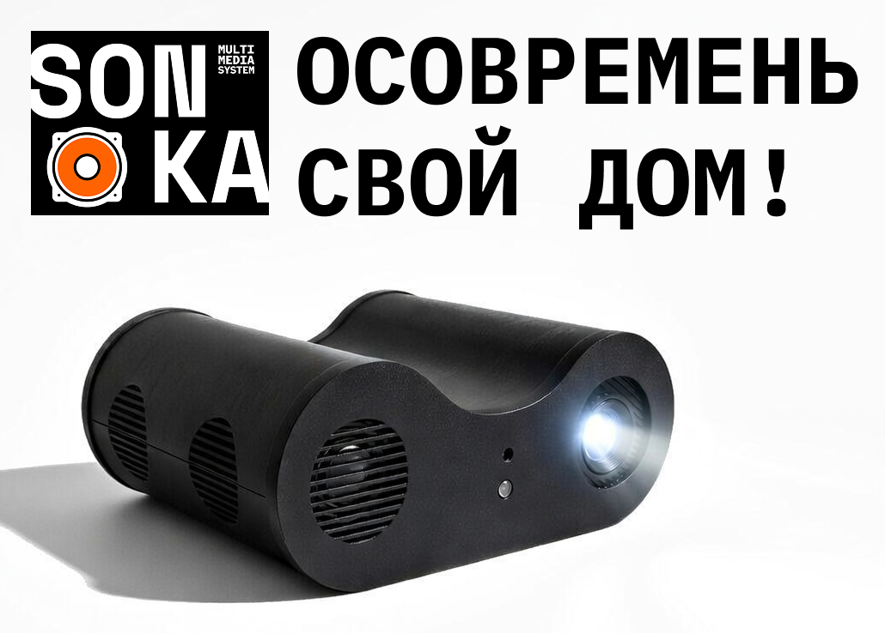

Рисунок
21 – Реклама

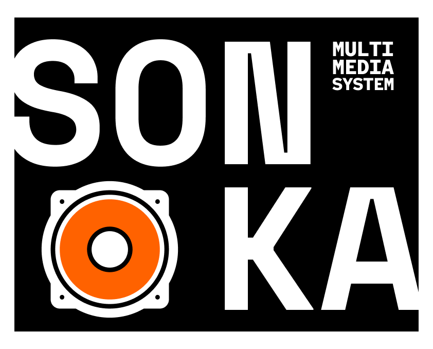

Рисунок
22 – Логотип

Целевая
аудитория: пользователи, заботящиеся
о приватности и открытости ПО, энтузиасты
«умного дома» и разработчики,
компании/коворкинги, ищущие кастомизируемые
решения, региональные рынки РФ, где
интерес к приватности и локальным
сервисам высок.

Стратегия
продвижения:

    •
Сообщество:
GitHub, форумы, Habr, Telegram, хакатоны.

    •
Контент-маркетинг:
блоги о приватности и кибер-безопасности,
инструкции по интеграции, видео с
демонстрациями.

    •
Партнёрства
с российскими сервисами

Продукты:
основная модель, лимитированные серии
корпусов

Каналы
продаж: Авито, сайт проекта

Расходы
на 1 устройство примерно 10160руб. Цена на
старте 12999руб, маржинальность на старте
= 22%, производство - 3шт в день, максимальная
выручка в месяц =255&nbsp;510руб. 

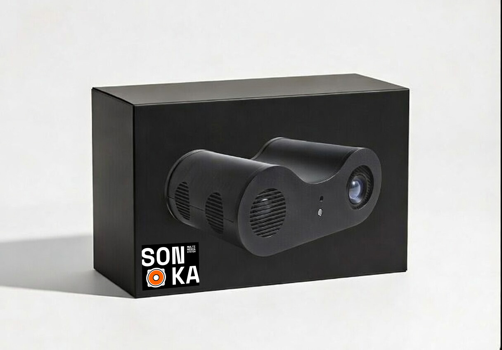

Рисунок
23 – Упаковка устройства

 
 

<h1 lang="ru-RU" class="western" align="justify" style="line-height: 150%">
 
 

</h1>
<ol start="7">
	<li><h1 class="western" style="margin-top: 0mm; line-height: 150%; page-break-before: always">
	ПРИЛОЖЕНИЕ
	Б</h1></li>
</ol>

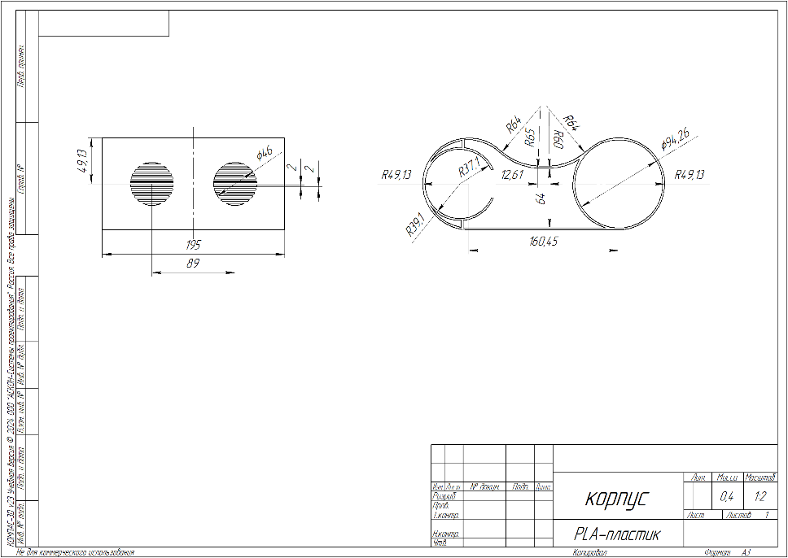

Рисунок
24 – Чертеж корпуса

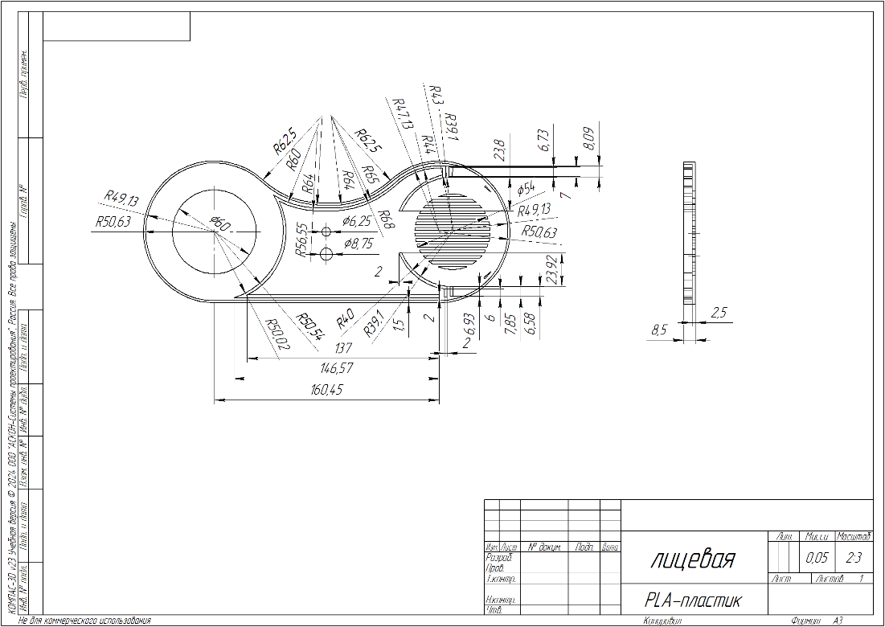

Рисунок
25 – Чертеж лицевой крышки

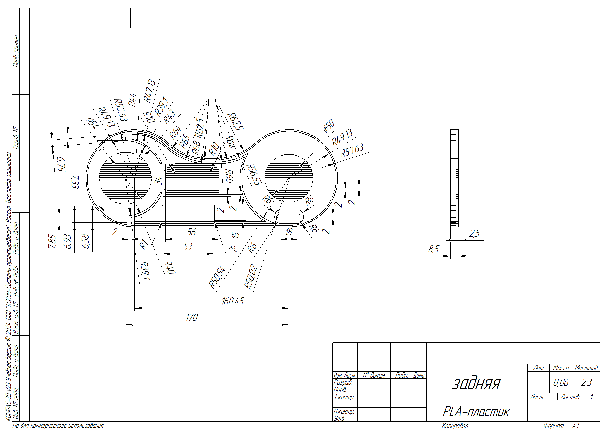

Рисунок
26 – Чертеж задней крышки

<h2 class="western" style="line-height: 150%"> 
 

</h2>
<ol start="8">
	<li><h1 class="western" style="margin-top: 0mm; line-height: 150%; page-break-before: always">
	ПРИЛОЖЕНИЕ
	В</h1></li>
</ol>

<b>Техника
безопасности</b>

Разработка,
сборка, настройка и использование моей
умной колонки связаны с рядом потенциальных
опасностей. Соблюдение следующих правил
является обязательным для предотвращения
травм, порчи оборудования и возникновения
чрезвычайных ситуаций.

<b>Общие
требования безопасности</b>

Работы
должны проводиться в специально
оборудованном, хорошо освещённом и
вентилируемом помещении (учебная
мастерская, лаборатория).

Необходимо
содержать рабочее место в чистоте, не
допуская загромождения инструментами,
деталями и посторонними предметами.

Запрещается
приступать к работе без ознакомления
с данным разделом и инструкциями к
используемому оборудованию (паяльник,
3D-принтер).

<b>Организация
рабочего места</b>

Рабочее
место для выполнения проекта было
организовано с учетом эргономики,
безопасности и рациональности размещения
оборудования для разработки умной
колонки. Основная работа проводилась
на столе, разделенном на зоны:
проектирования, сборки и производства.

В
зоне проектирования находился ноутбук
для разработки ПО и 3D-моделей,
размещенный на устойчивой поверхности
для удобного доступа. Кабели были
аккуратно организованы, чтобы избежать
натяжения.

Зона
сборки была оборудована паяльником с
термостабилизацией и подставкой для
инструментов. Электронные компоненты
хранились в отдельных контейнерах для
порядка и защиты.

3D-принтер
располагался на устойчивой поверхности
в хорошо проветриваемом помещении, при
этом зона вокруг него была свободной
от посторонних предметов для безопасной
работы. Организация рабочего места
повысила эффективность, снизила
количество ошибок и обеспечила
безопасность.

<b>Электробезопасность</b>

Паяльные
работы:

Использовать
исправный паяльник с подставкой. Работать
в защитных очках. Обеспечить принудительную
вытяжку паров канифоли. Не прикасаться
к нагретым элементам жала паяльника.

Монтаж
и отладка:

Перед
подачей питания на платы управления
всегда проверять правильность и
надёжность всех электрических соединений
во избежание коротких замыканий.
Отключать питание перед изменением
любой электрической схемы.

<b>Безопасность
при механической сборке и 3</b><b>D</b><b>-печати</b>

Работа
с 3D-принтером:

Не
прикасаться к нагреваемому столу и
экструдеру во время и сразу после работы
принтера. Соблюдать инструкции по
эксплуатации конкретной модели принтера.
Обеспечить вентиляцию помещения при
печати пластиком.

Механическая
обработка деталей: при необходимости
доработки напечатанных деталей
использовать защитные очки и фиксировать
деталь в тисках или струбцине.

 

	<sdfield type=PAGE subtype=RANDOM format=PAGE>31</sdfield>

</body>
</html>
